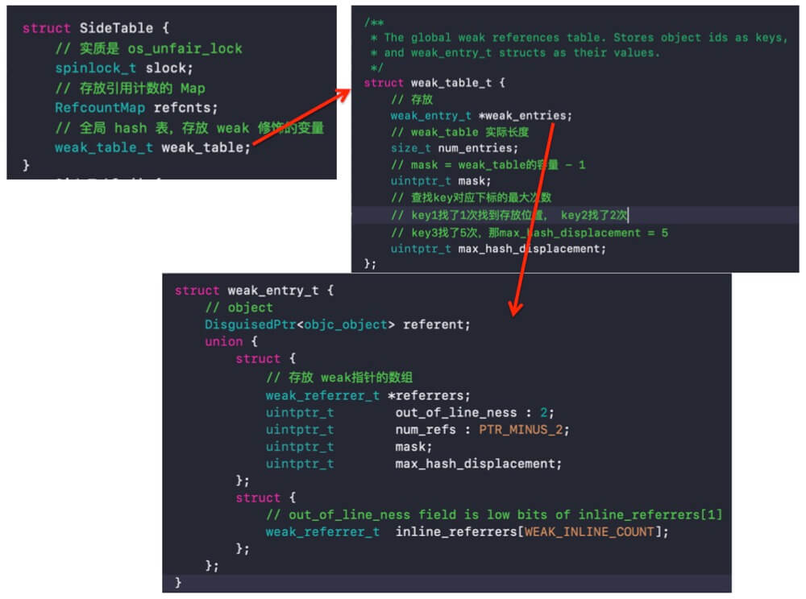
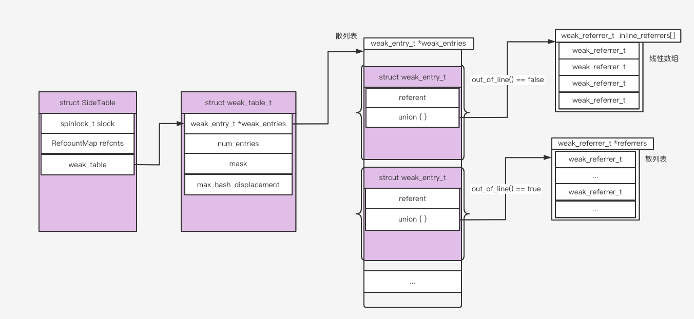
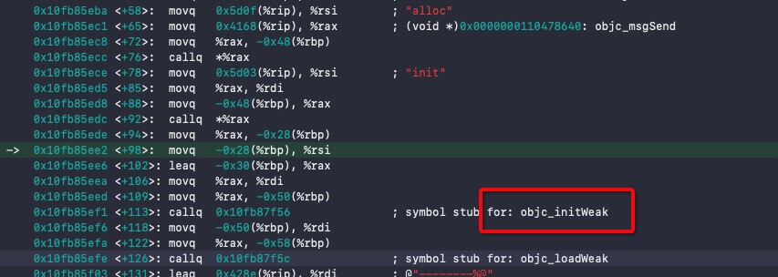
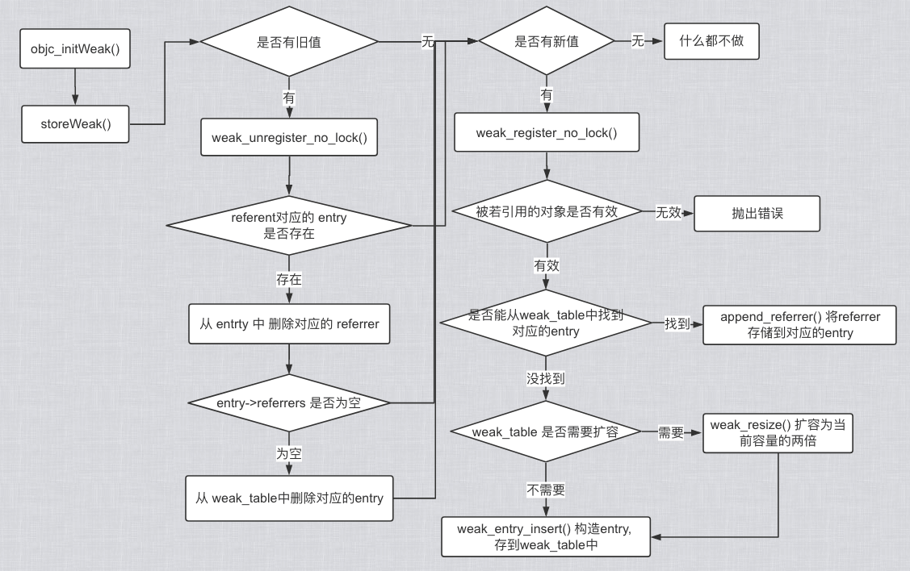

# 内存管理 - weak

<br>

`weak`弱引用，所修饰的对象的引用计数不会加1，在修饰对象被释放时会将对象置为`nil`，避免野指针访问，常用于解循环引用。本篇文章介绍`weak`的实现原理。

## 一、C++ 泛型

泛型在 C++ 中的主要实现为模板函数和模板类。

### 0x01 模板函数

通常使用普通的函数实现一个与数据类型有关的算法是很繁琐的，比如两个数的加法，要考虑很多类型：

```C++
int add(int a,int b) { return a+b; }

float add(float a,float b) { return  a+b; }
...
```

虽然在 C++ 中可以通过函数重载来解决这个问题，但是反复写相同算法的函数是比较辛苦的，更重要的是函数重载是静态编译，运行时占用过多内存。这是我们可以考虑用模板函数

```C++
template <typename T>
T add(T a, T b)
{
    return a + b;
}

NSLog(@"%d", add<int>(3, 5));
NSLog(@"%f", add<float>(3.2, 5.6));

// 打印结果
2019-07-31 11:49:05.011727+0800 MemoryManagement[24628:988328] 8
2019-07-31 11:49:05.011900+0800 MemoryManagement[24628:988328] 8.800000
```

### 0x02 模板类

类模板和函数模板有所不同，编译器不能为类模板推断模板类型，需要显式的指定参数类型。

```C++
template <class T>
class Stack {
private:
    vector<T> elems;
    
public:
    void push(T elem);
    void pop();
    T top();
};

// 入栈
template <class T>
void Stack<T>::push(T elem) {
    elems.push_back(elem);
}

// 出栈
template <class T>
void Stack<T>::pop() {
    if (elems.empty()) {
        NSLog(@"the stack is enpty");
        return;
    }
    elems.pop_back();
}

// 取栈顶元素
template <class T>
T Stack<T>::top() {
    if (elems.empty()) {
        NSLog(@"the stack is empty");
        return 0;
    }
    return elems.back();
}

- (void)viewDidLoad {
    [super viewDidLoad];
    
    Stack<int> intStack;  // int 类型的栈
    Stack<string> stringStack;    // string 类型的栈
    
    // 操作 int 类型的栈
    intStack.push(7);
    NSLog(@"%d", intStack.top());
    
    // 操作 string 类型的栈
    stringStack.push("hello");
    NSLog(@"%s", stringStack.top().c_str());
    stringStack.pop();
    stringStack.pop();
}

// 打印结果
2019-08-05 10:31:56.953464+0800 MemoryManagement[80311:2134907] 7
2019-08-05 10:31:56.953700+0800 MemoryManagement[80311:2134907] hello
2019-08-05 10:31:56.953870+0800 MemoryManagement[80311:2134907] the stack is empty
```

<br>

## 二、`weak_table` 表结构


### 0x01 `weak_table`表结构



`weak_table` 在结构体 `SideTable ` 中，`SideTable` 中三个成员，第一个`slock`是锁，第二个`refcnts` 用于存储对象的引用计数，第三个`weak_table`是弱引用表。定义如下：

```Objective-C
// NSObject.mm

struct SideTable {
    spinlock_t slock;
    RefcountMap refcnts;
    weak_table_t weak_table;
    ...
};
```

从注释上看`weak_table_t`是个全局的弱引用表，以`object`为`key`，
`weak_entry_t` 作为 `value`。`num_entries`是表中存储的`weak_entry_t`的个数。`mask`是`weak_entries` 的总容量减 1。如下：

```Objective-C
// objc-weak.h

/**
 * The global weak references table. Stores object ids as keys,
 * and weak_entry_t structs as their values.
 */
struct weak_table_t {
    weak_entry_t *weak_entries;
    size_t    num_entries;
    uintptr_t mask;
    uintptr_t max_hash_displacement;
};
```

在介绍`weak_entry_t`前，先介绍 [DisguisedPtr](https://github.com/zhaoName/Notes/blob/master/iOS/DisguisedPtr.md)，如下

```Objective-C
// objc-private.h

// DisguisedPtr<T> acts like pointer type T*, except the 
// stored value is disguised to hide it from tools like `leaks`.
template <typename T>
class DisguisedPtr {
	...
}


// The address of a __weak variable.
typedef DisguisedPtr<objc_object *> weak_referrer_t;
```

也就是说`DisguisedPtr<objc_object>`相当于`objc_object *`，`DisguisedPtr<objc_object *>`相当于`objc_object **`。

还有一点我们需要知道，OC 中的类实质是`objc_class`类型的结构体。而`objc_class `继承自`objc_object `。也就是说可以将`objc_object *`看成 OC 中的对象。

```Objective-C
// objc-weak.h

struct weak_entry_t {
    DisguisedPtr<objc_object> referent;
    union {
        struct {
            weak_referrer_t *referrers;
            uintptr_t        out_of_line_ness : 2;
            uintptr_t        num_refs : PTR_MINUS_2;
            uintptr_t        mask;
            uintptr_t        max_hash_displacement;
        };
        struct {
            // out_of_line_ness field is low bits of inline_referrers[1]
            weak_referrer_t  inline_referrers[WEAK_INLINE_COUNT];
        };
    };

    bool out_of_line() {
        return (out_of_line_ness == REFERRERS_OUT_OF_LINE);
    }

    weak_entry_t& operator=(const weak_entry_t& other) {
        memcpy(this, &other, sizeof(other));
        return *this;
    }
    
    // 初始化 weak_entry_t，初始元素存储在线性数组 inline_referrers 中
    weak_entry_t(objc_object *newReferent, objc_object **newReferrer) : referent(newReferent)
    {
        inline_referrers[0] = newReferrer;
        for (int i = 1; i < WEAK_INLINE_COUNT; i++) {
            inline_referrers[i] = nil;
        }
    }
};
```

在 `weak_entry_t` 结构中，`referent`是`weak`指向的 OC 对象，共用体中的 `weak_referrer_t *referrers` 和 `weak_referrer_t  inline_referrers[]` 存储的都是 `weak` 变量的地址。

- 若`out_of_line() == true`，则`weak` 变量地址存放散列表  `weak_referrer_t *referrers` 中；

- 若`out_of_line() == false`，则`weak`变量地址存放在线性数组 `weak_referrer_t  inline_referrers[]`中，且`inline_referrers`数组中最多能存储四个元素。

### 0x02 总结

weak 会存放在全局散列表 `weak_table_t` 中，`weak_table_t` 有两层散列。

- 第一层是 `weak_table_t` 中的 ` weak_entry_t *weak_entries`。`object` 当 key，`weak_entry_t` 当 value。

- 第二层是 `weak_entry_t` 中的 `weak_referrer_t *referrers`。key 和 value 都是`referrer` 也就是 `weak` 地址。

第二层散列需要注意的是，若指向同一个 object 的 weak 指针不超过 4 个，那 `referrer` 会存储在线性数组 `inline_referrers` 中。若超过 4 个，才会存储在散列表 `weak_referrer_t *referrers` 中。毕竟很少会有 4 个以上的 weak 变量同时指向一个 object。

我们在 `objc-weak.mm` 中实现一个打印 `weak_table_t` 的函数

```Objective-C
/**
 * 打印 weak_table 中的 referent(object)， 和 referent 对应的 referrer (weak 变量)
 */
void print_weak_table(weak_table_t *weak_table, objc_object *referent)
{
    ASSERT(referent);

    weak_entry_t *weak_entries = weak_table->weak_entries;

    if (!weak_entries) return;

    printf("***********print_weak_table: %p 对应的 weak 变量**************\n", referent);
    
    size_t begin = hash_pointer(referent) & weak_table->mask;
    size_t index = begin;
    size_t hash_displacement = 0;
    while (true) {
        if (hash_displacement > weak_table->max_hash_displacement) { break; }
        
        weak_entry_t *entry = &weak_table->weak_entries[index];
        if (!(*entry).out_of_line()) {
            // 存储在线性数组
            for (int i = 0; i < WEAK_INLINE_COUNT; i++) {
                objc_object ** referrer = (*entry).inline_referrers[i];
                printf("print_weak_table: inline_referrers[%d] ---%p \n", i, referrer);
            }
        } else {
            // 存储在散列表
            // 虽然存储在散列表，但这里并不知道 key 也就是我们要打印的 referrer,也就没发快速算出对应下标
            // 所以我们要 for 遍历打印
            for (unsigned long i = 0; i < (entry->mask + 1); i++) {
                objc_object ** referrer = entry->referrers[i];
                if (referrer) {
                    printf("print_weak_table: referrers[%ld] ---%p \n", i, referrer);
                }
            }
        }
        
        hash_displacement++;
        index = (index+1) & weak_table->mask;
    }
}
```

然后在 `main.mm` 中声明如下代码

```Objective-C
Person *per = [[Person alloc] init];

__weak Person *weakP1 = per;
__weak Person *weakP2 = per;
__weak Person *weakP3 = per;
__weak Person *weakP4 = per;
__weak Person *weakP5 = per;
```

打印结果如下，同时也证明我们的结论

```
objc_initWeak: 0x7ffeefbff4c8-----0x101215430 
***********print_weak_table: 0x101215430 对应的 weak 变量**************
print_weak_table: inline_referrers[0] ---0x7ffeefbff4c8 
print_weak_table: inline_referrers[1] ---0x0 
print_weak_table: inline_referrers[2] ---0x0 
print_weak_table: inline_referrers[3] ---0x0 


objc_initWeak: 0x7ffeefbff4d0-----0x101215430 
***********print_weak_table: 0x101215430 对应的 weak 变量**************
print_weak_table: inline_referrers[0] ---0x7ffeefbff4c8 
print_weak_table: inline_referrers[1] ---0x7ffeefbff4d0 
print_weak_table: inline_referrers[2] ---0x0 
print_weak_table: inline_referrers[3] ---0x0 


objc_initWeak: 0x7ffeefbff4d8-----0x101215430 
***********print_weak_table: 0x101215430 对应的 weak 变量**************
print_weak_table: inline_referrers[0] ---0x7ffeefbff4c8 
print_weak_table: inline_referrers[1] ---0x7ffeefbff4d0 
print_weak_table: inline_referrers[2] ---0x7ffeefbff4d8 
print_weak_table: inline_referrers[3] ---0x0 


objc_initWeak: 0x7ffeefbff4e0-----0x101215430 
***********print_weak_table: 0x101215430 对应的 weak 变量**************
print_weak_table: inline_referrers[0] ---0x7ffeefbff4c8 
print_weak_table: inline_referrers[1] ---0x7ffeefbff4d0 
print_weak_table: inline_referrers[2] ---0x7ffeefbff4d8 
print_weak_table: inline_referrers[3] ---0x7ffeefbff4e0 


objc_initWeak: 0x7ffeefbff4e8-----0x101215430 
***********print_weak_table: 0x101215430 对应的 weak 变量**************
print_weak_table: referrers[1] ---0x7ffeefbff4e0 
print_weak_table: referrers[2] ---0x7ffeefbff4d0 
print_weak_table: referrers[5] ---0x7ffeefbff4e8 
print_weak_table: referrers[6] ---0x7ffeefbff4d8 
print_weak_table: referrers[7] ---0x7ffeefbff4c8 
```



<br>

## 三、weak 底层实现


### 0x01 `objc_initWeak`

要想知道`weak`的实现原理，首先要知道入口在哪！给下面方法下断点，将 Xcode 调到汇编模式`Xcode->Debug->Debug Workflow->Always Show Diaseembly`

```
- (void)viewDidLoad {
    [super viewDidLoad];
    
    NSObject *obj = [[NSObject alloc] init];
    __weak NSObject* weakObj = obj;
}
```



可以看到初始化用`weak`修饰的变量，首先会调用`objc_initWeak`函数。

```
// objc4-750  NSObject.mm

/** 
 * Initialize a fresh weak pointer to some object location. 
 * It would be used for code like: 
 *
 * (The nil case) 
 * __weak id weakPtr;
 * (The non-nil case) 
 * NSObject *o = ...;
 * __weak id weakPtr = o;
 * 
 * This function IS NOT thread-safe with respect to concurrent 
 * modifications to the weak variable. (Concurrent weak clear is safe.)
 *
 * @param location Address of __weak ptr. 
 * @param newObj Object ptr. 
 */
id objc_initWeak(id *location, id newObj)
{
    if (!newObj) {
        *location = nil;
        return nil;
    }
    // location = &weakObj, newObj = obj
    return storeWeak<DontHaveOld, DoHaveNew, DoCrashIfDeallocating>(location, (objc_object*)newObj);
}
```

`objc_initWeak`方法内部调用`storeWeak `函数。传递两个参数，第一个参数是`id *`类型，可以看成`NSObject **`类型，指针的指针，结合注释里面存储的是`weak`指针的地址。第二个参数`id`类型，会强转成`objc_object*`，也就`weak`指针指向的对象。


### 0x02 `storeWeak `

```
// 更新 weak 变量
// 若 HaveOld = true，表示该变量存在需要清理的值
// 若 HaveNew = true, 表示有需要分配给该变量的新值
// 若 CrashIfDeallocating = true, 表示 newObj 正在释放或 newObj 不支持弱引用
// 若 CrashIfDeallocating = false, 用 nil 替代存储

template <bool HaveOld, bool HaveNew, bool CrashIfDeallocating>
static id storeWeak(id *location, objc_object *newObj)
{
    // 该过程用来更新弱引用指针的指向
    // 初始化 previouslyInitializedClass 指针
    Class previouslyInitializedClass = nil;
    id oldObj;

    // 声明两个 SideTable
    // ① 新旧散列创建
    SideTable *oldTable;
    SideTable *newTable;

    // 获得新值和旧值的锁存位置（用地址作为唯一标示）
    // 通过地址来建立索引标志，防止桶重复
    // 下面指向的操作会改变旧值
  retry:
    if (HaveOld) {
        // 更改指针，获得以 oldObj 为索引所存储的值地址
        oldObj = *location;
        oldTable = &SideTables()[oldObj];
    } else {
        oldTable = nil;
    }
    if (HaveNew) {
        // 更改新值指针，获得以 newObj 为索引所存储的值地址
        newTable = &SideTables()[newObj];
    } else {
        newTable = nil;
    }

    // 加锁操作，防止多线程中竞争冲突
    SideTable::lockTwo<HaveOld, HaveNew>(oldTable, newTable);

    // 避免线程冲突重处理
    // location 应该与 oldObj 保持一致，如果不同，说明当前的 location 已经处理过 oldObj 可是又被其他线程所修改
    if (HaveOld  &&  *location != oldObj) {
        SideTable::unlockTwo<HaveOld, HaveNew>(oldTable, newTable);
        goto retry;
    }

    // 防止弱引用间死锁
    // 并且通过 +initialize 初始化构造器保证所有弱引用的 isa 非空指向
    if (HaveNew  &&  newObj) {
        // 获得新对象的 isa 指针
        Class cls = newObj->getIsa();

        // 判断 isa 非空且已经初始化
        if (cls != previouslyInitializedClass && !((objc_class *)cls)->isInitialized()) {
            // 解锁
            SideTable::unlockTwo<HaveOld, HaveNew>(oldTable, newTable);
            // 对其 isa 指针进行初始化
            _class_initialize(_class_getNonMetaClass(cls, (id)newObj));

            // 如果该类已经完成执行 +initialize 方法是最理想情况
            // 如果该类 +initialize 在线程中 
            // 例如 +initialize 正在调用 storeWeak 方法
            // 需要手动对其增加保护策略，并设置 previouslyInitializedClass 指针进行标记
            previouslyInitializedClass = cls;

            // 重新尝试
            goto retry;
        }
    }

    // ② 清除旧值
    if (HaveOld) {
        weak_unregister_no_lock(&oldTable->weak_table, oldObj, location);
    }

    // ③ 分配新值
    if (HaveNew) {
        newObj = (objc_object *)weak_register_no_lock(&newTable->weak_table, (id)newObj, location, CrashIfDeallocating);
        // 如果弱引用被释放 weak_register_no_lock 方法返回 nil 
        // 在引用计数表中设置若引用标记位
        if (newObj  &&  !newObj->isTaggedPointer()) {
            // 弱引用位初始化操作
            // 引用计数那张散列表的weak引用对象的引用计数中标识为weak引用
            newObj->setWeaklyReferenced_nolock();
        }

        // 之前不要设置 location 对象，这里需要更改指针指向
        *location = (id)newObj;
    }
    else {
        // 没有新值，则无需更改
    }

    SideTable::unlockTwo<HaveOld, HaveNew>(oldTable, newTable);

    return (id)newObj;
}
```

`storeWeak`的作用是更新`weak_table`中对应的`entry->referrers`，新增`entry`并添加到`weak_table`中。


### 0x03 `weak_unregister_no_lock `

```
#define WEAK_INLINE_COUNT 4

void weak_unregister_no_lock(weak_table_t *weak_table, id referent_id, id *referrer_id)
{
    // newObj = obj
    objc_object *referent = (objc_object *)referent_id;
    // location = &weakObj
    objc_object **referrer = (objc_object **)referrer_id;

    weak_entry_t *entry;

    if (!referent) return;
    // 从 weak_table 中查找 referent(newObj) 对应的 entry
    if ((entry = weak_entry_for_referent(weak_table, referent))) {
        // 从 entry 中的 referrers 数组中删除对应的 referrer
        remove_referrer(entry, referrer);
        // 判断 referrers 是否为空
        bool empty = true;
        if (entry->out_of_line()  &&  entry->num_refs != 0) {
            // 若out_of_line 且 num_refs 不为0，说明 referrers 有值
            empty = false;
        }
        else {
            // 非 out_of_line，则遍历 inline_referrers 数组
            for (size_t i = 0; i < WEAK_INLINE_COUNT; i++) {
                if (entry->inline_referrers[i]) {
                    empty = false; 
                    break;
                }
            }
        }
        // 若 entry 中的 referrers 数组为空，说明没有 weak 指针指向此对象，则删除 weak_table 表中对应的entry
        if (empty) {
            weak_entry_remove(weak_table, entry);
        }
    }
    // 这里不会设置 *referrer = nil，因为 objc_storeWeak() 函数会需要该指针
}

// 从 entry->referrers 中删除对应的 old_referrer
static void remove_referrer(weak_entry_t *entry, objc_object **old_referrer)
{
    // 若 entry->out_of_line != 2,则遍历查找old_referrer
    if (!entry->out_of_line()) {
        for (size_t i = 0; i < WEAK_INLINE_COUNT; i++) {
            if (entry->inline_referrers[i] == old_referrer) {
                entry->inline_referrers[i] = nil;
                return;
            }
        }
        _objc_inform("Attempted to unregister unknown __weak variable "
                     "at %p. This is probably incorrect use of "
                     "objc_storeWeak() and objc_loadWeak(). "
                     "Break on objc_weak_error to debug.\n", 
                     old_referrer);
        objc_weak_error();
        return;
    }
    
    // 用 old_referrer(weak指针的地址) 算出初始 index
    size_t begin = w_hash_pointer(old_referrer) & (entry->mask);
    size_t index = begin;
    size_t hash_displacement = 0;
    // 从 entry 中取出 referrer，并和 old_referrer 比较
    while (entry->referrers[index] != old_referrer) {
        // 优先往下标大的地方找，最坏结果是类似 for 循环，遍历所有元素
        // 再结合 max_hash_displacement 限定查找次数
        index = (index+1) & entry->mask;
        // 当 index == begin 说明已循环查找一遍，且查找次数仍然没达到 max_hash_displacement
        // 那 weak_table 肯定有问题
        if (index == begin) bad_weak_table(entry);
        hash_displacement++;
        if (hash_displacement > entry->max_hash_displacement) {
            _objc_inform("Attempted to unregister unknown __weak variable "
                         "at %p. This is probably incorrect use of "
                         "objc_storeWeak() and objc_loadWeak(). "
                         "Break on objc_weak_error to debug.\n", 
                         old_referrer);
            objc_weak_error();
            return;
        }
    }
    // 找到对应的 referrer, 则删除
    entry->referrers[index] = nil;
    entry->num_refs--;
}

// 删除 weak_table 中的 entry
static void weak_entry_remove(weak_table_t *weak_table, weak_entry_t *entry)
{
    // remove entry
    if (entry->out_of_line()) free(entry->referrers);
    bzero(entry, sizeof(*entry));
    
    weak_table->num_entries--;
    // 删除元素导致 weak_table 的长度小到一定值时，就会压缩 weak_table 的容量
    weak_compact_maybe(weak_table);
}
```

`weak_unregister_no_lock `的作用是解除`weak_table`中旧对象与`weak`指针的绑定关系。为新对象与`weak`指针绑定做准备，有点类似这样：

```
NSObject *obj = [[NSObject alloc] init];
NSObject *obj1 = [[NSObject alloc] init];
__weak NSObject* weakObj = obj;
weakObj = obj1;
```


### 0x04 `weak_register_no_lock `

```
/** 
 * Registers a new (object, weak pointer) pair. Creates a new weak
 * object entry if it does not exist.
 * 
 * @param weak_table The global weak table.
 * @param referent The object pointed to by the weak reference.
 * @param referrer The weak pointer address.
 */
id weak_register_no_lock(weak_table_t *weak_table, id referent_id, id *referrer_id, bool crashIfDeallocating)
{
    // newObj = obj
    objc_object *referent = (objc_object *)referent_id;
    // location = &weakObj
    objc_object **referrer = (objc_object **)referrer_id;
    
    // 若 referent 为空或 referent 是 Tagged Pointer,则直接返回 referent_id，也就是weak 指针的地址
    if (!referent  ||  referent->isTaggedPointer()) return referent_id;

    // ensure that the referenced object is viable
    bool deallocating;
    if (!referent->ISA()->hasCustomRR()) {
        deallocating = referent->rootIsDeallocating();
    }
    else {
        BOOL (*allowsWeakReference)(objc_object *, SEL) = 
            (BOOL(*)(objc_object *, SEL)) object_getMethodImplementation((id)referent, SEL_allowsWeakReference);
        if ((IMP)allowsWeakReference == _objc_msgForward) {
            return nil;
        }
        deallocating = ! (*allowsWeakReference)(referent, SEL_allowsWeakReference);
    }

    if (deallocating) {
        if (crashIfDeallocating) {
            _objc_fatal("Cannot form weak reference to instance (%p) of "
                        "class %s. It is possible that this object was "
                        "over-released, or is in the process of deallocation.",
                        (void*)referent, object_getClassName((id)referent));
        } else {
            return nil;
        }
    }

    // now remember it and where it is being stored
    weak_entry_t *entry;
    if ((entry = weak_entry_for_referent(weak_table, referent))) {
        // 若从 weak_table 中找到对应的 entry, 则将 referent 存入 entry中
        append_referrer(entry, referrer);
    } 
    else {
        weak_entry_t new_entry(referent, referrer);
        // 判断是否需要扩容
        weak_grow_maybe(weak_table);
        // 将new_entry 存储到 weak_table
        weak_entry_insert(weak_table, &new_entry);
    }
    
    // 这里不会设置 *referrer = nil，因为 objc_storeWeak() 函数会需要该指针
    return referent_id;
}

/** 
 * Add new_entry to the object's table of weak references.
 * Does not check whether the referent is already in the table.
 */
static void weak_entry_insert(weak_table_t *weak_table, weak_entry_t *new_entry)
{
    weak_entry_t *weak_entries = weak_table->weak_entries;
    assert(weak_entries != nil);
    // 用 new_entry->referent(object) 算出 index 的初始值
    size_t begin = hash_pointer(new_entry->referent) & (weak_table->mask);
    size_t index = begin;
    size_t hash_displacement = 0;
    // 若 weak_entries[index].referent == nil 则找到要存储的位置
    while (weak_entries[index].referent != nil) {
        // index优先往下标大的地方找，最坏结果是类似 for 循环，遍历所有元素
        index = (index+1) & weak_table->mask;
        // 这时 weak_table 的长度肯定未超过容量的3/4
        // 若index == begin 说明已循环遍历一遍仍未找到要存储的位置，那weak_table 肯定有问题
        if (index == begin) bad_weak_table(weak_entries);
        // 记录此次查找 index 的次数
        hash_displacement++;
    }
    // 找到 index 就存起来，
    // 因为传进来的是 weak_entry_t* 类型的指针，要用*new_entry 取出 weak_entry_t 类型的值存到 weak_entries 数组中
    weak_entries[index] = *new_entry;
    // 表的
    weak_table->num_entries++;
    
    // 记录每次查找下标 index 的最大值，为取值
    if (hash_displacement > weak_table->max_hash_displacement) {
        weak_table->max_hash_displacement = hash_displacement;
    }
}
```

`weak_register_no_lock`的作用是将引用对象和`weak`指针的地址绑定起来，存储到`weak_table`中。


### 0x05 总结




<br>

## 四、弱引用释放底层实现


对象的释放会自动调用`dealloc`方法，`dealloc`方法的实现可以在`runtime`中找到。调用轨迹大致如下

- `dealloc`

- `_objc_rootDealloc`

- `rootDealloc`

- `rootDealloc`

- `object_dispose`

- `objc_destructInstance`

- `clearDeallocating`

- `clearDeallocating_slow`

- `weak_clear_no_lock`

在`weak_clear_no_lock `函数中会将`weak`修饰的对象置为`nil`，并从`weak_table`中移除对应的`entry`。


### 0x01 `objc_destructInstance `

```
// runtime-750  objc-runtime-new.mm

void *objc_destructInstance(id obj) 
{
    if (obj) {
        // Read all of the flags at once for performance.
        bool cxx = obj->hasCxxDtor();
        bool assoc = obj->hasAssociatedObjects();

        // This order is important.
        if (cxx) object_cxxDestruct(obj); // 释放成员变量
        if (assoc) _object_remove_assocations(obj); // 移除关联对象
        // 清空弱引用表 清空引用计数表
        obj->clearDeallocating();
    }

    return obj;
}
```

### 0x02 `clearDeallocating_slow`

```
// runtime-750  NSObject.mm

NEVER_INLINE void objc_object::clearDeallocating_slow()
{
    assert(isa.nonpointer  &&  (isa.weakly_referenced || isa.has_sidetable_rc));

    SideTable& table = SideTables()[this];
    table.lock();
    // 若对象被弱引用
    if (isa.weakly_referenced) {
        weak_clear_no_lock(&table.weak_table, (id)this);
    }
    // 若对象的引用计数存储在 SideTable 中，则清空引用计数表
    if (isa.has_sidetable_rc) {
        table.refcnts.erase(this);
    }
    table.unlock();
}
```


### 0x03 `weak_clear_no_lock`


```
// runtime-750  objc-weak.mm

void weak_clear_no_lock(weak_table_t *weak_table, id referent_id)
{
    // object
    objc_object *referent = (objc_object *)referent_id;
    // 取出 referent(object) 对应的 entry
    weak_entry_t *entry = weak_entry_for_referent(weak_table, referent);
    if (entry == nil) {
        /// XXX shouldn't happen, but does with mismatched CF/objc
        //printf("XXX no entry for clear deallocating %p\n", referent);
        return;
    }

    // zero out references
    weak_referrer_t *referrers;
    size_t count;
    
    if (entry->out_of_line()) {
        // hash 结构的数组
        referrers = entry->referrers;
        count = TABLE_SIZE(entry);
    } 
    else {
        // 正常顺序存储的数组
        referrers = entry->inline_referrers;
        count = WEAK_INLINE_COUNT;
    }
    
    for (size_t i = 0; i < count; ++i) {
        objc_object **referrer = referrers[i];
        if (referrer) {
            if (*referrer == referent) {
                // 将对象置为 nil
                *referrer = nil;
            }
            else if (*referrer) {
                _objc_inform("__weak variable at %p holds %p instead of %p. "
                             "This is probably incorrect use of "
                             "objc_storeWeak() and objc_loadWeak(). "
                             "Break on objc_weak_error to debug.\n", 
                             referrer, (void*)*referrer, (void*)referent);
                objc_weak_error();
            }
        }
    }
    // 从 weak_table 中移除对应的 entry
    weak_entry_remove(weak_table, entry);
}

static void weak_entry_remove(weak_table_t *weak_table, weak_entry_t *entry)
{
    // remove entry
    if (entry->out_of_line()) free(entry->referrers);
    bzero(entry, sizeof(*entry));
    
    weak_table->num_entries--;
    // 删除元素导致 weak_table 的长度小到一定值时，将会压缩 weak_table 的容量
    weak_compact_maybe(weak_table);
}
```


<br>

**参考：**

- [C++ 模板](https://www.runoob.com/cplusplus/cpp-templates.html)

- [weak 弱引用的实现方式](https://www.desgard.com/iOS-Source-Probe/Objective-C/Runtime/weak%20%E5%BC%B1%E5%BC%95%E7%94%A8%E7%9A%84%E5%AE%9E%E7%8E%B0%E6%96%B9%E5%BC%8F.html)

<br>

写于2019-07-30  完成于2019-08-06

<br>