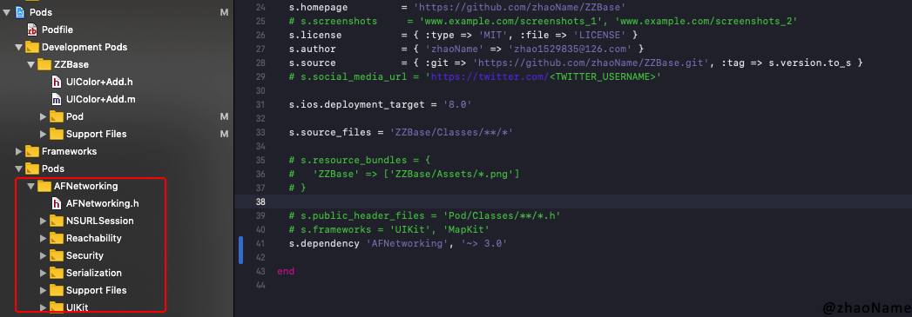
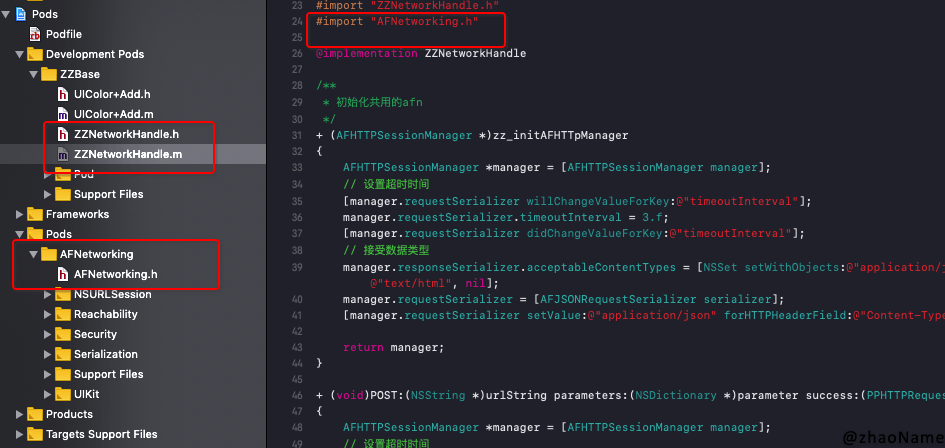
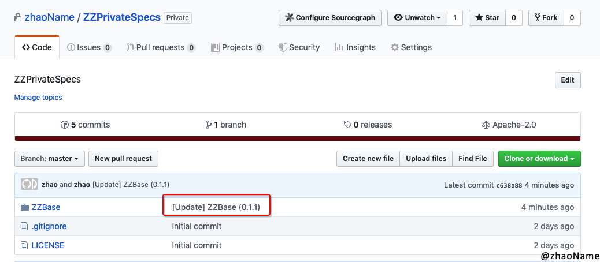
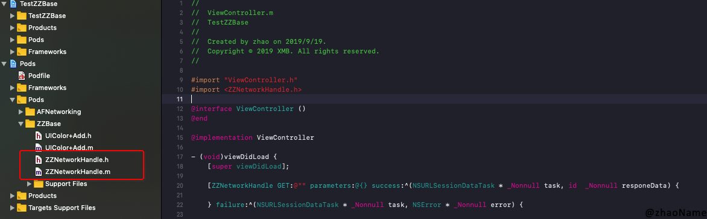
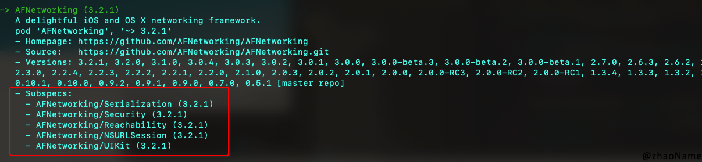
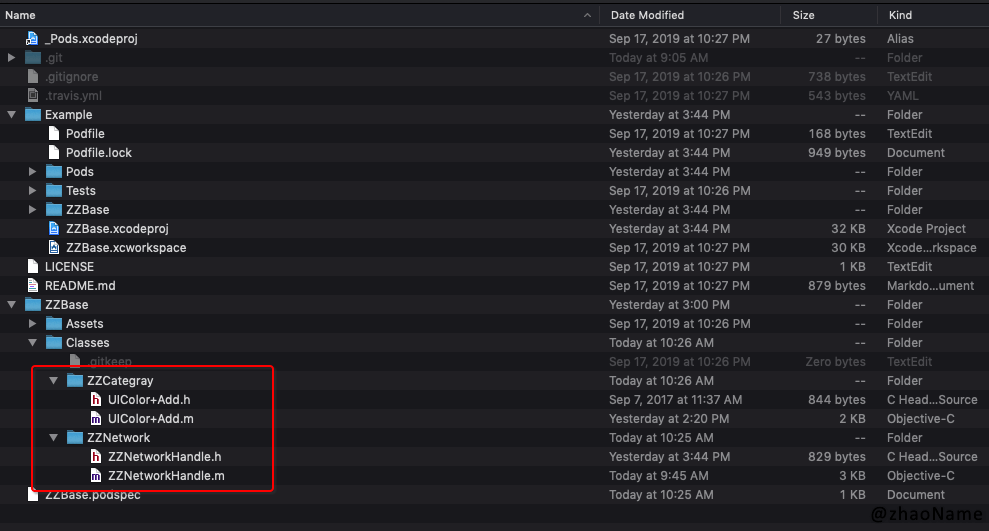
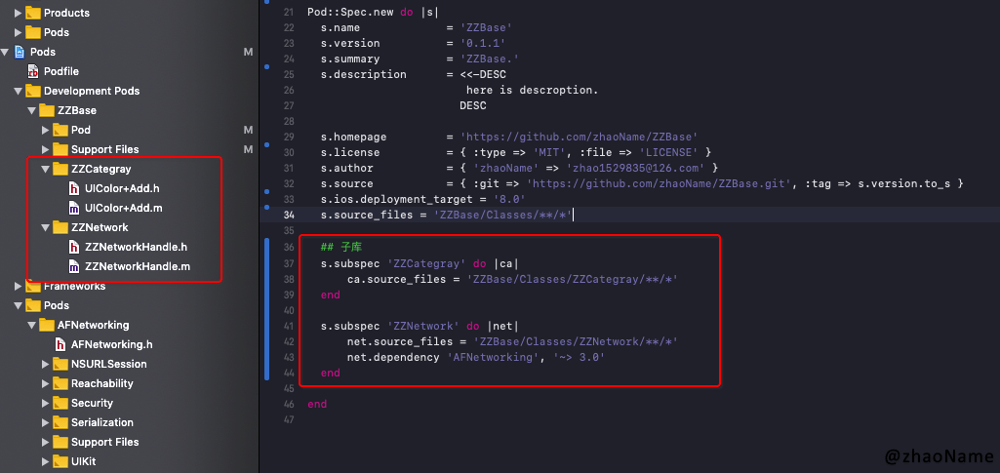
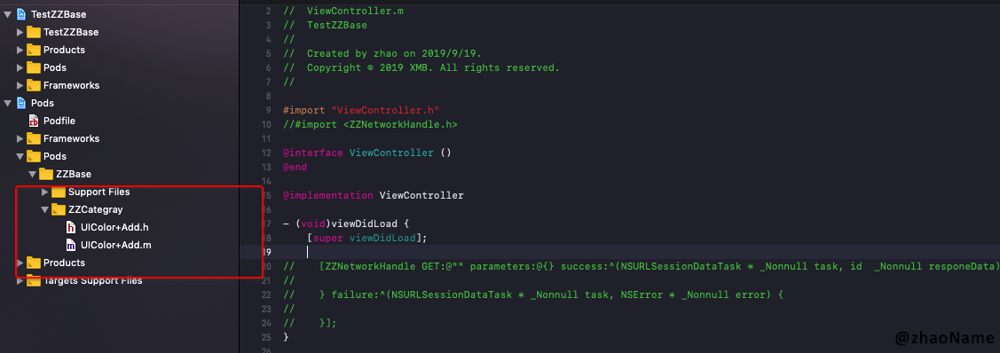

# 组件化(一) - 私有库使用


<br>

从 [Cocoapods - Private Pods](https://github.com/zhaoName/Notes/blob/master/iOS/Cocoapods%20-%20Private%20Pods.md) 中我们知道如何创建远程私有库。但这远远不够，因为在实际开发中将项目组件化还需要更新私有库、依赖别的三方库、加载资源文件、多人合作、子库等操作。下面介绍下常用的。


## 一、添加三方依赖库

`AFNetworking`是常用的网络加载库，我们以`AFNetworking`为例讲解添加三方依赖库。

私有库使用三方依赖库需要修改`spec`文件，开启权限。

```
s.dependency 'AFNetworking', '~> 3.0'
```

再执行`pod install`，将`AFNetworking `添加到项目中。

```
$ cd ~/Desktop/ZZBase/Example
$ pod isntall

Analyzing dependencies
Fetching podspec for `ZZBase` from `../`
Downloading dependencies
Installing AFNetworking (3.2.1)
Installing ZZBase 0.1.0
Generating Pods project
Integrating client project
Sending stats
Pod installation complete! There is 1 dependency from the Podfile and 2 total pods installed.
```




到此三方依赖已添加完毕，然后我们再将`AFNetworking`用起来。


## 二、私有库更新


新建`ZZNetworkHandle`类，对`AFNetworking `进行二次封装。然后将`ZZNetworkHandle `放到`Classes`文件夹中。执行`pod install`


```
$ pod install

Analyzing dependencies
Fetching podspec for `ZZBase` from `../`
Downloading dependencies
Using AFNetworking (3.2.1)
Using ZZBase (0.1.0)
Generating Pods project
Integrating client project
Sending stats
Pod installation complete! There is 1 dependency from the Podfile and 2 total pods installed.
```




可以看到`ZZNetworkHandle `已经在私有库中。然后修改`spec`文件中的版本号

```
s.version          = '0.1.1'
```

这样我们想要更新的内容已经全部修改完成。

### 0x01 提交代码到`ZZBase`远程仓库

```
$ cd ~/Desktop/ZZBase/

$ git add .
$ git commit -m "add NetworkHandle"
$ git push origin master

Enumerating objects: 102, done.
Counting objects: 100% (102/102), done.
Delta compression using up to 4 threads
Compressing objects: 100% (76/76), done.
Writing objects: 100% (78/78), 109.93 KiB | 4.78 MiB/s, done.
Total 78 (delta 33), reused 0 (delta 0)
remote: Resolving deltas: 100% (33/33), completed with 16 local objects.
To https://github.com/zhaoName/ZZBase.git
   46b66a8..b8d3eba  master -> master
```

### 0x02 打标签

```
$ git tag '0.1.1'       
$ git push origin 0.1.1 

Total 0 (delta 0), reused 0 (delta 0)
To https://github.com/zhaoName/ZZBase.git
 * [new tag]         0.1.1 -> 0.1.1
```


### 0x03 验证`spec`

```
$ pod spec lint --allow-warnings

 -> ZZBase (0.1.1)
    - WARN  | url: The URL (https://github.com/zhaoName/ZZBase) is not reachable.
    - NOTE  | xcodebuild:  note: Using new build system
    - NOTE  | [iOS] xcodebuild:  note: Planning build
    - NOTE  | [iOS] xcodebuild:  note: Constructing build description

Analyzed 1 podspec.

ZZBase.podspec passed validation.
```


### 0x04 更新索引库

```
$ pod repo push ZZPrivateSpecs ZZBase.podspec

Validating spec
 -> ZZBase (0.1.1)
    - WARN  | url: The URL (https://github.com/zhaoName/ZZBase) is not reachable.
    - NOTE  | xcodebuild:  note: Using new build system
    - NOTE  | [iOS] xcodebuild:  note: Planning build
    - NOTE  | [iOS] xcodebuild:  note: Constructing build description

Updating the `ZZPrivateSpecs' repo


Adding the spec to the `ZZPrivateSpecs' repo

 - [Update] ZZBase (0.1.1)

Pushing the `ZZPrivateSpecs' repo
```

搜索`ZZBase`，可以看到其最新版本已经变成`0.1.1`。

```
$ pod search ZZBase

-> ZZBase (0.1.1)
   ZZBase.
   pod 'ZZBase', '~> 0.1.1'
   - Homepage: https://github.com/zhaoName/ZZBase
   - Source:   https://github.com/zhaoName/ZZBase.git
   - Versions: 0.1.1, 0.1.0 [ZZPrivateSpecs repo]
```

远程私有索引库也已经更新。




### 0x05 使用最新的 ZZBase

```
$ cd ~/Desktop/TestZZBase/

$ pod update ZZBase

Update all pods
Analyzing dependencies
Downloading dependencies
Installing AFNetworking (3.2.1)
Installing ZZBase 0.1.1 (was 0.1.0)
Generating Pods project
Integrating client project
Sending stats
Pod installation complete! There is 1 dependency from the Podfile and 2 total pods installed.
```

可以看到新添加的网络相关类`ZZNetworkHandle `和三方依赖库`AFNetworking`都安装到工程中。



## 三、子库 Subspec


从上图看到我们自己开发的私有库只有两个类：`UIColor+Add`和`ZZNetworkHandle `，且在同一个文件夹下。这样在私有库越来越大时，看起来会很乱。我们会想到把分类统一放到一个文件夹，把网络相关类放到一个文件夹，后面再有别的功能模块也同意放到一个文件夹下。

更进一步，还可能会想到：在使用私有库时能不能只使用私有库的某项功能，如只使用`ZZBase`的网络相关类。这就涉及到**子库`SubSpecs`**的概念。


`Subspec`在很多三方库中都有用到，如`AFNetworking`




若我们只想使用`AFNetworking`的网络监听功能，可以修改`Podfile`文件。

```
pod 'AFNetworking/Reachability'
```


### 0x01 子库格式

```
Pod::Spec.new do |s|

  s.name = 'SpecName'
  s.subspec 'SubspecName' do |Subspecs 别名|
  
  end
end
```

下面我们对`ZZBase`进行改造，让其有两个子库：`ZZCategray`和`ZZNetwork`

### 0x02 修改`ZZBase.podspec`文件

```
Pod::Spec.new do |s|
  s.name             = 'ZZBase'
  s.version          = '0.1.1'
  s.summary          = 'ZZBase.'
  s.description      = <<-DESC
                        here is descroption.
                       DESC

  s.homepage         = 'https://github.com/zhaoName/ZZBase'
  s.license          = { :type => 'MIT', :file => 'LICENSE' }
  s.author           = { 'zhaoName' => 'zhao1529835@126.com' }
  s.source           = { :git => 'https://github.com/zhaoName/ZZBase.git', :tag => s.version.to_s }
  s.ios.deployment_target = '8.0'
  s.source_files = 'ZZBase/Classes/**/*'
  
  ## 子库
  s.subspec 'ZZCategray' do |ca|
      ca.source_files = 'ZZBase/Classes/ZZCategray/**/*'
  end
  
  s.subspec 'ZZNetwork' do |net|
      net.source_files = 'ZZBase/Classes/ZZNetwork/**/*'
      net.dependency 'AFNetworking', '~> 3.0'
  end
  
end
```

### 0x03 修改`ZZBase`工程目录

在`Classes`文件夹下添加`ZZCategray`和`ZZNetwork`两个文件夹




### 0x04 安装到测试工程

```
$ pod install

Analyzing dependencies
Fetching podspec for `ZZBase` from `../`
Downloading dependencies
Using AFNetworking (3.2.1)
Installing ZZBase 0.1.1 (was 0.1.0)
Generating Pods project
Integrating client project
Sending stats
Pod installation complete! There is 1 dependency from the Podfile and 2 total pods installed.
```




### 0x05 使用子库

用上述更新私有库的方法将`0.1.2`版本的`ZZBase`更新到远程私有库。然后搜索

```
$ pod search ZZBase 

-> ZZBase (0.1.2)
   ZZBase.
   pod 'ZZBase', '~> 0.1.2'
   - Homepage: https://github.com/zhaoName/ZZBase
   - Source:   https://github.com/zhaoName/ZZBase.git
   - Versions: 0.1.2, 0.1.1, 0.1.0 [ZZPrivateSpecs repo]
   - Subspecs:
     - ZZBase/ZZCategray (0.1.2)
     - ZZBase/ZZNetwork (0.1.2)
```

可以看到`ZZBase`已经存在子库的功能，下面我们来试用下:只导入`ZZCategray`

-  修改`TestZZBase`工程的`Podfile`文件

```
source 'https://github.com/CocoaPods/Specs.git'
source 'https://github.com/zhaoName/ZZPrivateSpecs.git'

platform :ios, '9.0'
target 'TestZZBase' do

  use_frameworks!

  pod 'ZZBase/ZZCategray'
end
```

- 安装

```
$ cd ~/Desktop/TestZZBase
$ pod install

Analyzing dependencies
Downloading dependencies
Installing ZZBase 0.1.2 (was 0.1.1)
Removing AFNetworking
Generating Pods project
Integrating client project
Sending stats
Pod installation complete! There is 1 dependency from the Podfile and 1 total pod installed.
```




可以到`ZZBase`已经更新到`0.1.2`版本，且`AFNetworking `已经移除，这是因为`ZZCategray `并没有用到`AFNetworking `。

<br>

**参考：**

- [Podspec Syntax Reference](https://guides.cocoapods.org/syntax/podspec.html#subspec)

- [iOS 组件化开发（二）：远程私有库的更新与子库](https://juejin.im/post/5ac5daf451882555627d8491)

<br>

写于 2019-09-19

<br>
