# 组件化(三) - 加载资源文件.md

<br>

## 一、前提

要想正确的加载图片、storyboard、xib等资源文件，首先要搞清楚你的 pod 是静态库还是动态库，pod 格式不一样，加载资源的路径就不一样。


### 0x01 静态私有库

若在`.podspec`文件中设置 `static_framework = true`，则编译出来的是个`.framework`格式的静态库。且`.bundle`不在`.framework`文件中，也就是说资源文件不在`.framework`路径下。

查看`ZZLoginAndRegister.framework`的格式

```
$ file ZZLoginAndRegister 
ZZLoginAndRegister: Mach-O universal binary with 2 architectures: [arm_v7:current ar archive] [arm64:current ar archive]
ZZLoginAndRegister (for architecture armv7):	current ar archive
ZZLoginAndRegister (for architecture arm64):	current ar archive
```

在`/ZZLoginAndRegister_Example.app/`目录下查看`ZZLoginAndRegister.bundle`

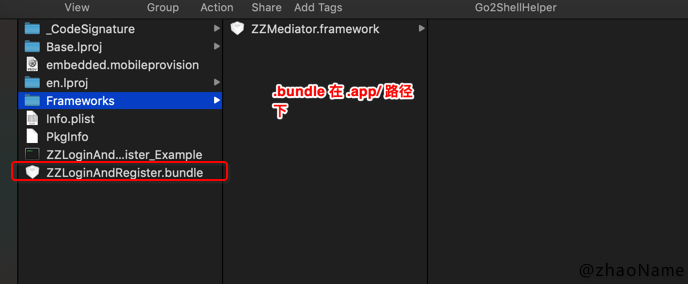


### 0x02 动态私有库


若在`.podspec`文件中设置 `static_framework = false`，或没有在`.podspec`中添加`static_framework `参数，则编译出来的就是个动态库。

查看`ZZSettings.framework`的格式

```
$ file ZZSettings

ZZSettings: Mach-O universal binary with 2 architectures: [arm_v7:Mach-O dynamically linked shared library arm_v7] [arm64:Mach-O 64-bit dynamically linked shared library arm64]
ZZSettings (for architecture armv7):	Mach-O dynamically linked shared library arm_v7
ZZSettings (for architecture arm64):	Mach-O 64-bit dynamically linked shared library arm64
```

在`/ZZSettings_Example.app/Frameworks/Settings.framework/`目录下查看`Settings.bundle`

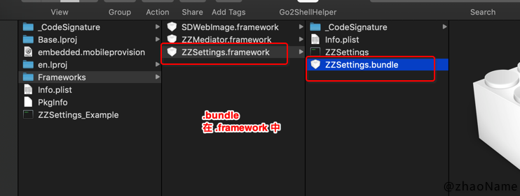


<br> 


## 二、加载图片


### 0x01 准备

在私有库的`/pod_name/Assets/`目录下添加图片资源，

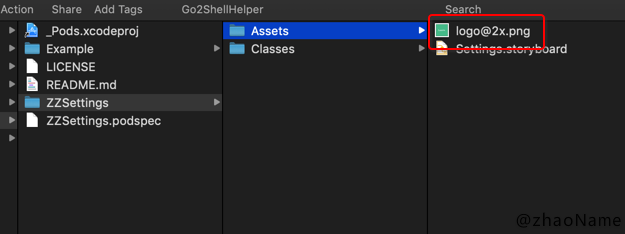


修改`.podspec` 文件，

```
## 图片
s.resource_bundles = {
	'ZZSettings' => ['ZZSettings/Assets/*.png']
}
```

`pod install`将图片加载到私有库中

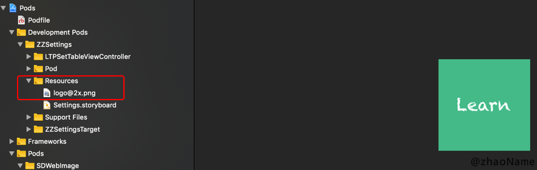

### 0x02 imageNamed: 为什么在组件中加载不到图片

使用图片，将其加载到屏幕上。但你发现图片并没有显示出来。

```
[self.avaterBtn setImage:[UIImage imageNamed:@"logo"] forState:UIControlStateNormal];
```

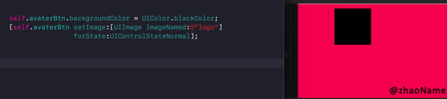


这是为啥呢？我们看下苹果文档上给`imageNamed:`的解释。

```
// load from main bundle
+ (nullable UIImage *)imageNamed:(NSString *)name;      
```

也就是说调用`imageNamed:`方法会从`main bundle`中加载资源，那`main bundle`指的是哪个路径呢？我们可以打印看下

```
NSLog(@"mainBundle:%@", [NSBundle mainBundle].bundlePath);

// 打印结果
mainBundle:/var/containers/Bundle/Application/9C6EEAD8-B453-479F-B50E-0EEB87C33FCB/ZZSettings_Example.app/
```

也就说这里都是`main bundle`。

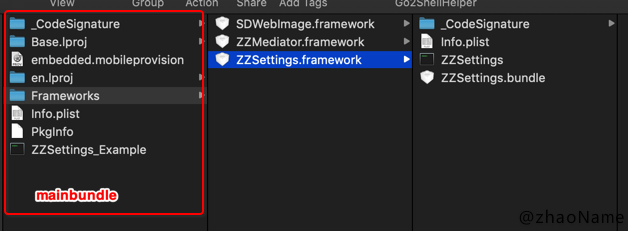

可以看到组件中的图片并不在`main bundle`中，所以使用`imageNamed:`加载不到图片。

无论 pod 是静态库还是动态库，pod 中的图片都在`.bundle`文件夹中。但`.bundle`的路径会随着库的格式不同而不同。下面介绍下如何加载 pod 中的图片


### 0x03 pod 是动态库

若 pod 是动态库，则`podName.bundle`在`/xxx.app/Frameworks/podName.framework/`路径下


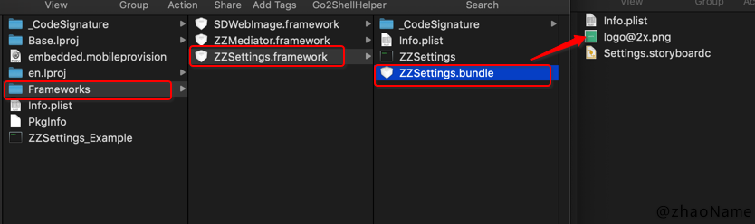

对应的加载图片代码如下

```
- (UIImage *)imageWithName:(NSString *)imageName
{
    // 图片全名，@2x @3x 也要带上
    imageName = [NSString stringWithFormat:@"%@@%dx.png", imageName, (int)[UIScreen mainScreen].scale];
    NSBundle *bundle = [NSBundle bundleForClass:self.class];
    NSString *zzBaseBunleName = bundle.infoDictionary[@"CFBundleName"];
    NSString *baseDirectory = [NSString stringWithFormat:@"%@.bundle", zzBaseBunleName];
    
    NSString *path = [bundle pathForResource:imageName ofType:nil inDirectory:baseDirectory];
    return [UIImage imageWithContentsOfFile:path];
}
```

### 0x04 pod 是静态库

若 pod 是静态库，则`podName.bundle`在`/xxx.app/`路径下

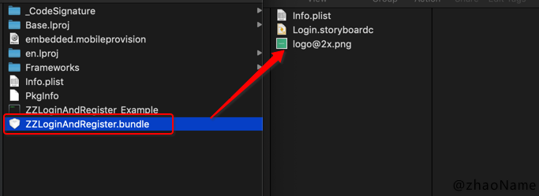

这时用`[NSBundle bundleForClass:self.class]`获取到的是 main bundle，而不是对应的 podName.bundle 

所以对应的正确加载图片代码如下

```
- (UIImage *)imageWithName:(NSString *)imageName bundleName:(NSString *)bundleName
{
    // 图片全名，@2x @3x 也要带上
    imageName = [NSString stringWithFormat:@"%@@%dx.png", imageName, (int)[UIScreen mainScreen].scale];
    // 获取 podName.bundle 路径
    NSString *path = [[NSBundle mainBundle] pathForResource:bundleName ofType:@"bundle"];
    path = [path stringByAppendingPathComponent:imageName];
    return [UIImage imageWithContentsOfFile:path];
}
```

<br>


## 二、加载 storyboard


### 0x01 准备工作


平常我们加载 storyboard 会使用如下代码，

```
[UIStoryboard storyboardWithName:@"storyborad_name" bundle:nil]
```

但这句代码在组件化中使用会出问题，我们先来看下官方文档对`storyboardWithName: bundle:`方法第二个参数的解释

> The bundle containing the storyboard file and its related resources. If you specify nil, this method looks in the main bundle of the current application.

官方解释中特殊说明当第二个参数为 nil 时，会到 main bundle 中查找对应的 storyboard。很显然当我们使用组件化时，各个组件的 storyboard 文件不会在 main bundle 中，而在各自组件的 bundle 中。

### 0x02 pod 是动态库

pod 是动态库时，storyboard 可以放在 podName/Classes/ 路径下，也可以放在 podName/Assets/ 路径下。

- 放在 podName/Classes/ 路径下

```
- (UIViewController *)st_provideSetVC
{
    NSBundle *bundle = [NSBundle bundleForClass:self.class];
    return [[UIStoryboard storyboardWithName:@"Settings" bundle:bundle] instantiateInitialViewController];
}
```


- 放在 podName/Assets/ 路径下

```
- (UIViewController *)st_provideSetVC
{
    NSBundle *bundle = [NSBundle bundleForClass:self.class];
    NSString *baseDirectory = [NSString stringWithFormat:@"%@.bundle", bundle.infoDictionary[@"CFBundleName"]];
    NSString *path = [bundle.bundlePath stringByAppendingPathComponent:baseDirectory];
    bundle = [NSBundle bundleWithPath:path];
    
    return [[UIStoryboard storyboardWithName:@"Settings" bundle:bundle] instantiateInitialViewController];
}
```

### 0x03 pod 是静态库


若 pod 是静态库，则 storyboard 必须放在 podName/Assets/ 路径下。

```
- (UIViewController *)lr_fetchLoginVC
{
    NSString *path = [[NSBundle mainBundle] pathForResource:@"ZZLoginAndRegister" ofType:@"bundle"];
    NSBundle *bundle =  [NSBundle bundleWithPath:path];
    return [[UIStoryboard storyboardWithName:@"Login" bundle:bundle] instantiateInitialViewController];
}
```

<br>


## 三、 加载 Xib


加载 Xib 文件通常用如下代码

```
[[NSBundle mainBundle] loadNibNamed:@"xibName" owner:self options:nil]
```

这也是从 main bundle 中加载 xib。对于各个组件来说，我们需要找到对应的 bundle 才能正确的加载 xib 文件。

### 0x01 pod 是动态库


pod 是动态库时，xib 可以放在 podName/Classes/ 路径下，也可以放在 podName/Assets/ 路径下。

- 放在 podName/Classes/ 路径下

```
[[[NSBundle bundleForClass:self.class] loadNibNamed:@"xibName" owner:self options:nil] lastObject]
```


- 放在 podName/Assets/ 路径下

```
NSBundle *bundle = [NSBundle bundleForClass:self.class];
NSString *baseDirectory = [NSString stringWithFormat:@"%@.bundle", bundle.infoDictionary[@"CFBundleName"]];
NSString *path = [bundle.bundlePath stringByAppendingPathComponent:baseDirectory];
bundle = [NSBundle bundleWithPath:path];

[[bundle loadNibNamed:@"xibName" owner:self options:nil] lastObject];
```

### 0x02 pod 是静态库


若 pod 是静态库，则 xib 必须放在 podName/Assets/ 路径下

```
NSString *path = [[NSBundle mainBundle] pathForResource:@"podName" ofType:@"bundle"];
[[NSBundle bundleWithPath:path] loadNibNamed:@"xibName" owner:nil options:nil].lastObject;
```


**注意对于 storyboard 或 xib 说，无论是动态库还是静态库，若 storyboard 或 xib 放在 podName/Assets/ 路径下, 则必须修改`.podspec`文件中的`resource_bundles`参数。**

```

Pod::Spec.new do |s|
  s.name             = 'podName'
  s.resource_bundles = {
      'podName' => ['podName/Assets/*.storyboard', ...]
    }
  ...
end
```

<br>


## 四、 storyboard 或 xib 中使用 UIImageView

若 storyboard 和图片都放在 /podName/Asstes/ 目录下，无论 pod 是动态库还是静态库，都需要在图片名后面加上后缀名，否则显示不出来。

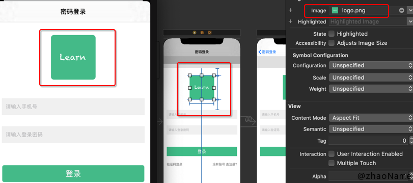


若图片放在 /podName/Asstes/ 目录下， storyboard 放在/podName/Classes/ 目录下。则需要在图片名前加上`podName.bundle` ，指定图片的路径。这样虽然在 storyboard 中看不到效果，但确实能加载出来。

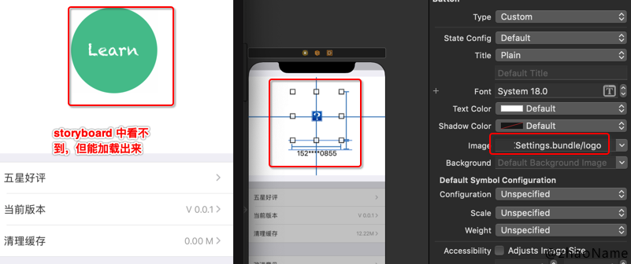

**注意**这里有个很坑的地方，当 storyboard 和图片分开放，且用后缀名`imageName.png`的方式，虽然在 storyboard 中能看到效果，但实际却是加载不出来

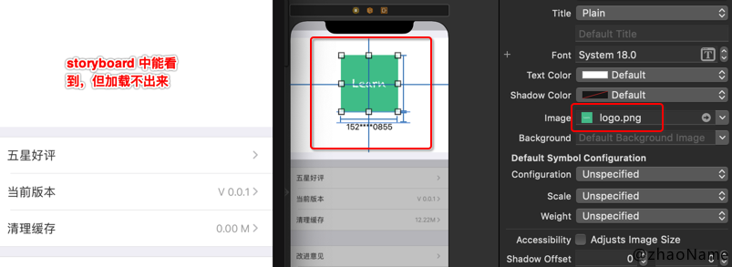


上述只用 storyboard 举例，对 xib 也一样有效。

<br>

## 四、plist 文件


在验证时，可能会出现如下错误

```
$ pod lib lint --allow-warnings 

 -> ZZTranslate (0.0.1)
    - WARN  | url: The URL (https://github.com/zhaoName/ZZTranslate) is not reachable.
    - ERROR | [iOS] xcodebuild: Returned an unsuccessful exit code. You can use `--verbose` for more information.
    - NOTE  | xcodebuild:  note: Using new build system

[!] ZZTranslate did not pass validation, due to 1 error.
You can use the `--no-clean` option to inspect any issue.
```

这里报错并不明显，在使用如下命令

```
$ pod lib lint --allow-warnings --verbose

...
error: Unexpected duplicate tasks:
    1) Target 'ZZTranslate' (project 'Pods') has copy command from '~/ZZTranslate/ZZTranslate/Classes/PPTranslateViewController/PPTips.plist' to '~/Library/Developer/Xcode/DerivedData/App-bhumbygkibcaibgjxyhqkibyskxf/Build/Products/Release-iphonesimulator/ZZTranslate/ZZTranslate.framework/PPTips.plist'
    2) Target 'ZZTranslate' (project 'Pods') has copy command from '~/ZZTranslate/ZZTranslate/Classes/PPTranslateViewController/PPTips.plist' to '~/Library/Developer/Xcode/DerivedData/App-bhumbygkibcaibgjxyhqkibyskxf/Build/Products/Release-iphonesimulator/ZZTranslate/ZZTranslate.framework/PPTips.plist'
...
```

可以看到是 plist 文件报错，此时 plist 放在 podName/Classes/ 路径下，且程序运行没有问题，但验证就是报错。


我们尝试将 plist 文件放在 podName/Assets/ 路径下，并修改`.podspec`文件中的`resource_bundles `参数。

- 在动态库中使用如下代码

```
NSBundle *bundle = [NSBundle bundleForClass:self];
NSString *bundleName = [NSString stringWithFormat:@"%@.bundle", bundle.infoDictionary[@"CFBundleName"]];
// 得到 plist 文件路径
NSString *file = [bundle pathForResource:@"PPTips" ofType:@".plist" inDirectory:bundleName];

NSMutableArray *arr = [[NSMutableArray alloc] initWithContentsOfFile:file];
```

- 在静态库中使用如下代码

```
NSString *path = [[NSBundle mainBundle] pathForResource:@"podName" ofType:@"bundle"];
// plist 文件路径
path = [path stringByAppendingPathComponent:@"PPTips.plist"];
NSMutableArray *arr = [[NSMutableArray alloc] initWithContentsOfFile:file];
```

然后再去验证

```
$ pod lib lint --allow-warnings 

 -> ZZTranslate (0.0.1)
    - NOTE  | xcodebuild:  note: Using new build system
    - NOTE  | [iOS] xcodebuild:  note: Planning build

ZZTranslate passed validation.
```


<br>

写于 2019-11-03

<br>