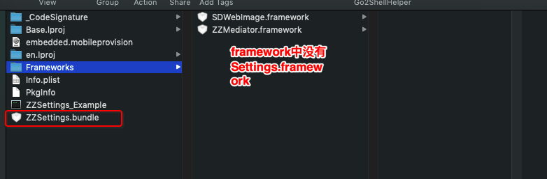
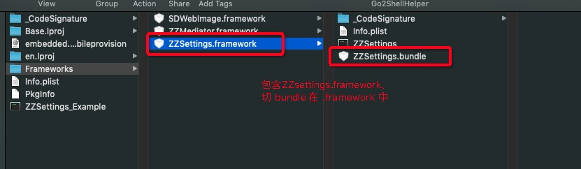
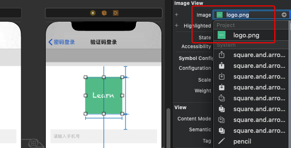

# 组件化(二) - 细节处理

<br>


## 一、私有库依赖问题

在组件化过程中，各个组件都会依赖中间组件，下面以登录注册模块依赖中间组件为例，解释私有库之间依赖的解决方案。

在登录注册模块的 .podspec 文件中

```
Pod::Spec.new do |s|
  s.name             = 'ZZLoginAndRegister'
  ...
  
  s.dependency 'mob_smssdk', '~> 3.2.3'
  s.dependency 'ZZMediator/ZZMediator+ZZBaseTool'
  
end
```

然后在 Terminal 中执行将依赖库安装到工程

```
$ cd ~/Desktop/Module/ZZLoginAndRegister/Example
$ pod install

Analyzing dependencies
Fetching podspec for `ZZLoginAndRegister` from `../`
[!] Unable to find a specification for `ZZMediator/ZZMediator+ZZBaseTool` depended upon by `ZZLoginAndRegister`

You have either:
 * out-of-date source repos which you can update with `pod repo update` or with `pod install --repo-update`.
 * mistyped the name or version.
 * not added the source repo that hosts the Podspec to your Podfile.

Note: as of CocoaPods 1.0, `pod repo update` does not happen on `pod install` by default.

```

可以看到报错：找不到`ZZMediator/ZZMediator+ZZBaseTool`的 spec。为什么呢？私有库 ZZMediator 已经发布。

这是因为 cocoapods 默认会到`https://github.com/CocoaPods/Specs.git` 中查找 spec (也就是本地的 ~/.cocoapods/repo/ 中查找)。

或者到指定路径中查找，如 `pod 'ZZLoginAndRegister', :path => '../'`。显然这两个地方都找不到 ZZMediator.podspec

解决方案有两个：

### 0x01 指定路径

到登录注册模块的 Podfile 文件指定 ZZMediator 的路径

```
platform :ios, '8.0'
target 'ZZLoginAndRegister_Example' do

  pod 'ZZLoginAndRegister', :path => '../'
  pod 'ZZMediator/ZZMediator+ZZBaseTool', :path => '~/Desktop/Module/ZZMediator'
  
end
```

这样不是中好的解决方案，因为路径写死了，多人合作时你怎么保证你的小伙伴也是这个路径呢！！！


### 0x02 指定源

在登录注册模块的 Podfile 中添加 ZZMediator 所需要的源

```
source 'https://github.com/CocoaPods/Specs.git'
source 'https://github.com/zhaoName/ZZPrivateSpecs.git'

platform :ios, '8.0'
target 'ZZLoginAndRegister_Example' do

  pod 'ZZLoginAndRegister', :path => '../'
  
end
```

在登录注册模块的 .podspec 文件中正常添加依赖

```
Pod::Spec.new do |s|
  s.name             = 'ZZLoginAndRegister'
  ...
  
  s.dependency 'mob_smssdk', '~> 3.2.3'
  s.dependency 'ZZMediator/ZZMediator+ZZBaseTool'
  
end
```

然后在执行`pod install`就能顺利将	`ZZMediator/ZZMediator+ZZBaseTool`私有库安装到登录注册模块。


<br>

## 二、 引用的三方库是静态库

在组件化过程中不可避免的会遇到引用的三方库是以静态库开源的。而使用`pod lib create PodName`创建的模板中的 Podfile 文件默认是有`use_frameworks!`。这时执行`pod isnstall`会报错。

```
$ pod install
                    
Analyzing dependencies
Fetching podspec for `ZZLoginAndRegister` from `../`
Downloading dependencies
Installing MOBFoundation (3.2.6)
Installing ZZLoginAndRegister 0.0.1
Installing mob_smssdk (3.2.3)
[!] The 'Pods-ZZLoginAndRegister_Example' target has transitive dependencies that include statically linked binaries: (/Users/chuangqi/Desktop/Module/ZZLoginAndRegister/Example/Pods/mob_smssdk/SDK/SMSSDK/SMS_SDK.framework)

```

那我们的第一想法肯定是将`use_frameworks!`从 Podfile 文件中删除，这时就能成功安装。但是这样做之后编译出来的 ZZLoginAndRegister 是`.a`格式的静态库。


若你不想将所有代码都开源，这样的做法也行。但若你想打包成`.framework`格式的静态库，或者你的代码中包含 Swift 代码，必须要使用`use_frameworks!`。那该咋办呢？

Cocoapods 提供一个参数可以在使用`use_frameworks!`的情况下，在组件中引用静态库。那就是在 .podspec 文件中加入`static_framework `。

```
Pod::Spec.new do |s|
  s.name             = 'ZZLoginAndRegister'
  s.static_framework = true
  s.dependency 'mob_smssdk', '~> 3.2.3'
  s.dependency 'ZZMediator/ZZMediator+ZZBaseTool'
  
  ...
end
```

这样编译出来的就是`.framework`静态库


<br>

## 三、加载 storyboard 问题


### 0x01 准备工作


平常我们加载 storyboard 会使用如下代码，

```
[UIStoryboard storyboardWithName:@"storyborad_name" bundle:nil]
```

但这句代码在组件化中使用会出问题，我们先来看下官方文档对`storyboardWithName: bundle:`方法第二个参数的解释

> The bundle containing the storyboard file and its related resources. If you specify nil, this method looks in the main bundle of the current application.

官方解释中特殊说明当第二个参数为 nil 时，会到 main bundle 中查找对应的 storyboard。很显然当我们使用组件化时，各个组件的 storyboard 文件不会在 main bundle 中，而在各自组件的 bundle 中。

下面以设置模块为例，说明在组件化中怎么加载 storyboard ！

- 将 Settings.storyboard 放到 ZZSettings/Assets/ 目录下


- 修改 .podspec 文件，设置 resource_bundles 

```

Pod::Spec.new do |s|
  s.name             = 'ZZSettings'
  s.resource_bundles = {
      'ZZSettings' => ['ZZSettings/Assets/*.png', 'ZZSettings/Assets/*.storyboard']
    }
  ...
end
```

这步很重要，若不设置则此组件将不有 bundle，也就加载不到 storyboard。


### 0x02 加载 storyboard

**加载 storyboard 分两种情况：**

- 在`.podspec`文件中设置 `static_framework = true`

若在`.podspec`文件中设置 `static_framework = true`，则编译出来的是个静态库，且 `bundle`不在`.framework`静态库中。

查看`ZZSettings.framework`的格式

```
$ file ZZSettings 

ZZSettings: Mach-O universal binary with 2 architectures: [arm_v7:current ar archive] [arm64:current ar archive]
ZZSettings (for architecture armv7):	current ar archive
ZZSettings (for architecture arm64):	current ar archive
```

查看`Settings.bundle`的位置，在`/ZZSettings_Example.app/`目录下



那我们就要用如下的代码加载 storyboard

```
- (LTPSetTableViewController *)lr_fetchLoginVC
{
    NSString *path = [[NSBundle mainBundle] pathForResource:@"ZZSettings" ofType:@"bundle"];
    NSBundle *bundle =  [NSBundle bundleWithPath:path];
    return [[UIStoryboard storyboardWithName:@"Settings" bundle:bundle] instantiateInitialViewController];
}
```

- 没有在`.podspec`文件中设置 `static_framework = true`

若没有在`.podspec`文件中设置 `static_framework = true`，那编译出来的就是个动态库，且 bundle 在`.framework`动态库中。


查看`ZZSettings.framework`的格式

```
$ file ZZSettings

ZZSettings: Mach-O universal binary with 2 architectures: [arm_v7:Mach-O dynamically linked shared library arm_v7] [arm64:Mach-O 64-bit dynamically linked shared library arm64]
ZZSettings (for architecture armv7):	Mach-O dynamically linked shared library arm_v7
ZZSettings (for architecture arm64):	Mach-O 64-bit dynamically linked shared library arm64
```

查看`Settings.bundle`的位置，在`/ZZSettings_Example.app/Settings.framework/`目录下




那我们就要用如下代码加载 storyboard

```
- (LTPSetTableViewController *)st_provideSetVC
{
    NSBundle *bundle = [NSBundle bundleForClass:self.class];
    NSString *baseDirectory = [NSString stringWithFormat:@"%@.bundle", bundle.infoDictionary[@"CFBundleName"]];
    NSString *path = [bundle.bundlePath stringByAppendingPathComponent:baseDirectory];
    bundle = [NSBundle bundleWithPath:path];
    
    return [[UIStoryboard storyboardWithName:@"Settings" bundle:bundle] instantiateInitialViewController];
}
```


### 0x02 storyboard 中使用 UIImageView

将 storyboard 和图片放在 Asstes/ 目录后，在 storyboard 中设置图片和平常有点区别：图片要带后缀名





<br>


## 四、


<br>

**参考：**

- [static_framework](https://guides.cocoapods.org/syntax/podspec.html#static_framework)


<br>

写于 2019-10-23

<br>