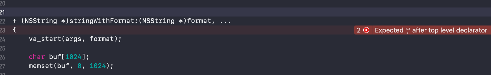

# Hook 可变参数

<br>

在编写程序时`NSString`可以说是最常用的类了，常用创建方式有`initWithFormat:`和`stringWithFormat：`两种。这两种方式都有可变参数，在逆向时该怎么`hook`呢？


## 一、准备工作


### 0x01 `memset`


`memset`是一个`C`语言库函数，作用是将某块内存中的内容全部设置为指定的值。一般用于内存空间初始化。

- 声明

```
void *memset(void *str, int c, size_t n)
```

- 参数

	- str -- 指向要填充的内存块。

	- c -- 要被设置的值。该值以 int 形式传递，但是函数在填充内存块时是使用该值的无符号字符形式。

	- n -- 要被设置为该值的字节数。

	
- 示例

```
#include <string.h>

// 声明一个 char 类型的数组，并将值全部初始化为 0
char buf[1024];
memset(buf, 0, 1024);
```

### 0x02 `va_list` 和 `vsprintf`


`va_list`是`C`语言中为解决可变参数问题的一组宏，在`<stdarg.h>`标准库中。常用的有`va_list`、`va_start`、`va_arg`、`va_end`。

- `va_start`

```
void va_start(va_list ap, last_arg);
```

作用是初始化`va_list ap`变量，`last_arg `是最后一个传递给函数的已知的固定参数，即省略号之前的参数。这个宏必须在使用`va_arg ` 和`va_end ` 之前被调用。

- `va_arg `

```
type va_arg(va_list ap, type)
```

作用是检索函数参数列表中类型为 type 的下一个参数。


- `vsprintf `

`vsprintf `是`C`语言标准库` <stdio.h>`下函数，作用是使用参数列表发送格式化输出到字符串。

```
int vsprintf(char *str, const char *format, va_list arg)
```

`str` - 输出的字符串数组

`format` - 可被随后的附加参数中指定的值替换，并按需求进行格式化

`arg` -  表示可变参数列表的对象

 返回值 - 如果成功，则返回写入的字符总数，否则返回一个负数。

**注意`vsprintf `不能识别`OC`中的`%@`和对象类型**

- 示例

```
void testWrite(char *format, ...)
{
    va_list va;
    
    char buf[1024];
    memset(buf, 0, 1024);
    
    va_start(va, format);
    vsprintf(buf, format, va);
    
    va_end(va);
    NSLog(@"%s", buf);
}

void testRead(int num, ...)
{
    va_list va;
    va_start(va, num);
    
    for (int i=0; i<num; i++) {
        NSLog(@"%d",  va_arg(va, int));
    }
    
    va_end(va);
}

int main() {
	int num = 4;
    testWrite("age = %d, string = %s", num, "string");
    testRead(3, 10, 12, 15);
}

// 打印结果
2019-06-20 16:06:18.521267+0800 HookArgList[21976:137612] age = 4, string = string
2019-06-20 16:06:18.521373+0800 HookArgList[21976:137612] 10
2019-06-20 16:06:18.521456+0800 HookArgList[21976:137612] 12
2019-06-20 16:06:18.521536+0800 HookArgList[21976:137612] 15
```


## 二、`hook `可变参数


### 0x01 runtime方法交换

开始的想法是`hook``stringWithFormat:`和`initWithFormat:`这两个方法。但在`logos`语法中会报错



又在[这里](http://iosre.com/t/hook-stringwithformat/5195/18)看到`stringWithFormat:`内部会调用`initWithFormat:locale:arguments:`方法。但是`hook`下面两个方法后，并没有什么用。。。

```
- (NSString *)initWithFormat:(NSString *)format arguments:(va_list)argList
{
}

- (NSString *)initWithFormat:(NSString *)format locale:(id)locale arguments:(va_list)argList
{
}
```


最后才去一个取巧的办法，每次用`runtime `手动替换来达到目的。

假设有`HookArguments`类中的`test`方法中用到`stringWithFormat:`方法

```
// HookArguments.m
- (void)test:(NSString *)str
{
    NSString *string = [NSString stringWithFormat:@"HookArguments:%@", [[NSObject alloc] init]];
    NSLog(@"sign:%@", string);
}
```


用`CaptainHook`

```
CHDeclareClass(HookArguments);

id stringWithFormat(id self, SEL op, id format, ...);

id stringWithFormat(id self, SEL op, id format, ...)
{
    va_list va;
    va_start(va, format);
    
    char buf[1024];
    memset(buf, 0, 1024);
    vsprintf(buf, [format cStringUsingEncoding:4], va);
    
    id result = [[NSString alloc] initWithFormat:format arguments:va];
    
    NSLog(@"format:%@-----------result：%@", format, result);
    
    va_end(va);
    return result;
}


CHOptimizedMethod1(self, BOOL, HookArguments, test, id, str)
{
    //先获取原来的Method和IMP备用
    Method originalMethod = class_getClassMethod(NSClassFromString( @"NSString" ), NSSelectorFromString( @"stringWithFormat:" ));
    IMP originalIMP = method_getImplementation(originalMethod);
    //设置方法的实现为自己的
    method_setImplementation(originalMethod, (IMP)stringWithFormat );
    BOOL result = CHSuper1(HookArguments, test, str);
    //执行完替换回原方法
    method_setImplementation(originalMethod, (IMP) originalIMP );
    return result;
}

CHConstructor {
    CHLoadLateClass(HookArguments);
    CHHook1(HookArguments, test);
}


// 打印结果
2019-06-21 23:05:21.868702+0800 HookArgList[298:8685] format:HookArguments:%@-----------result：HookArguments:<NSObject: 0x1c00106a0>
2019-06-21 23:05:21.868971+0800 HookArgList[298:8685] sign:HookArguments:<NSObject: 0x1c00106a0>
```

但是这样写有个不好的地方就是不能全局`hook NSString`的方法，必须要找到对应的方法。


### 0x02 `method_exchangeImplementations`


`logos`语法不支持直接`hook`带可变参数的`OC`方法，我们可以取巧使用`runtime`的黑魔法。新建一个`NNString `的分类，在分类中实现方法交换


```
// NSString+hook.m
+ (void)load
{
    Method orignalClassMethod = class_getClassMethod([NSString class], @selector(stringWithFormat:));
    Method currentClassMethod = class_getClassMethod([NSString class], @selector(zn_stringWithFormat:));
    method_exchangeImplementations(orignalClassMethod, currentClassMethod);
    
    Method origanlInstanceMethod = class_getInstanceMethod([NSString class], @selector(initWithFormat:));
    Method currentInstanceMethod = class_getInstanceMethod([NSString class], @selector(zn_initWithFormat:));
    method_exchangeImplementations(origanlInstanceMethod, currentInstanceMethod);
}


+ (NSString *)zn_stringWithFormat:(NSString *)format, ...
{
    va_list va;
    va_start(va, format);
    
    char buf[1024];
    memset(buf, 0, 1024);
    
    vsprintf(buf, [format cStringUsingEncoding:4], va);
    va_end(va);
    
    NSString *result = [[NSString alloc] initWithFormat:format arguments:va];
    NSLog(@"stringWithFormat========format：%@====vsprintf：%s====result：%@", format, buf, result);
    return result;
}

- (NSString *)zn_initWithFormat:(NSString *)format, ...
{
    va_list va;
    va_start(va, format);
    
    char *buf[1024];
    memset(buf, 0, 1024);
    
    memcpy(buf, va, 20*8);
    va_end(va);
    
    NSString *result = [[NSString alloc] zn_initWithFormat:format, buf[0], buf[1], buf[2], buf[3], buf[4], buf[5], buf[6], buf[7], buf[8], buf[9], buf[10], buf[11], buf[12],buf[13], buf[14], buf[15], buf[16], buf[17],buf[18], buf[19]];
    NSLog(@"stringWithFormat========format：%@====vsprintf：%s====result：%@", format, buf, result);
    return result;
}
```

然后直接运行程序也能拦截到`stringWithFormat:`和`initWithFormat:`


```
// 打印结果
2019-06-24 16:06:08.432419 HookArgList[2924:559851] initWithFormat========format：%d %f %@====buf：====result：10 3.141593 instanceTestOC

2019-06-24 16:06:08.432669 HookArgList[2924:559851] stringWithFormat========format：%d %f %@====vsprintf：20 5.200000 @====result：20 5.200000 classTestOC

2019-06-24 16:06:08.432902 HookArgList[2924:559851] stringWithFormat========format：HookArguments:%@====vsprintf：HookArguments:@====result：HookArguments:<NSObject: 0x17400a9b0>
```

<br>

参考：

- `memset` : `https://www.runoob.com/cprogramming/c-function-memset.html`

- `va_list`: `https://blog.csdn.net/mj_lee/article/details/80703893`

- `vsprintf ` ：`https://www.runoob.com/cprogramming/c-function-vsprintf.html`

- `https://inferior.wang/2018/10/18/01-hookstringWithFormat/`

<br>

写于2019-06-21

<br>