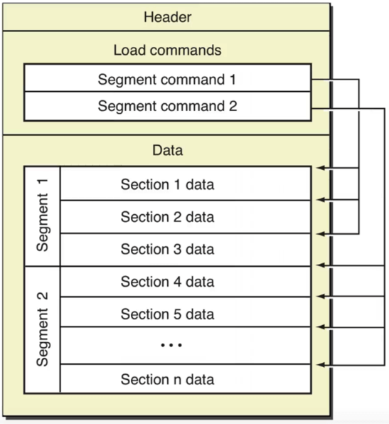
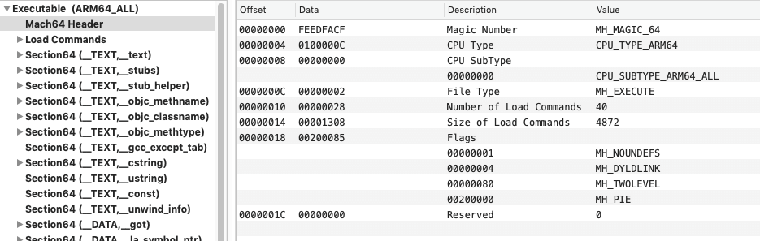

# Mach-O

<br>

## 一、简介

### 0x01 Mach-O 文件格式

Mach-O(Mach Object) 是 macOS 和 iOS 上的可执行文件。常见的 Mach-O 格式

- 目标文件  .o 

- 库文件

	- .a

	- .dylib

	- framework

- 可执行文件

- dyld 动态链接器

- .dsym 符号表

可以用命令 `file`查看文件具体类型。

```
$ file Mach-O_file_name
```

### 0x01 Mach-O 文件结构

上一张网络上经典图



- `Headers`：头部 存储 Mach-O 元信息，如架构、CPU类型等

- `Load Commands`  加载命令。指示如何加载每个`Segment`的信息

- `Segment`  段。可以有很多`Segment`，每个`Segment`可以有多个或零个`Secton`。每个`Segment`都有一段虚拟地址映射到进程的地址空间

- 链接信息：一个完整的用户级Mach-o文件的末端是链接信息。其中包含了动态加载器用来链接可执行文件或者依赖库所需 使用的符号表，字符串表等等。

<br>

## 二、 Header

### 0x01 查看 Mach-O 文件头部信息

- 命令

```
$ otool -hv NowBooK   

Mach header
      magic cputype cpusubtype  caps    filetype ncmds sizeofcmds      flags
MH_MAGIC_64   ARM64        ALL  0x00     EXECUTE    40       4872   NOUNDEFS DYLDLINK TWOLEVEL PIE
```

- MachOView

MachOView 是一个分析 Mach-O 文件的图形界面工具,你可以自己去`GitHub`上搜索




### 0x02 `mach_header_64 ` 结构

打开 Xcode 使用快捷键`command + shift + o`,搜索`loader.h`文件,可以看到`struct mach_header_64`. 这就是 Mach-O 文件的 Header 类型.

```C
/*
 * The 64-bit mach header appears at the very beginning of object files for
 * 64-bit architectures.
 */
struct mach_header_64 {
    uint32_t    magic;        /* mach magic number identifier */
    cpu_type_t    cputype;    /* cpu specifier */
    cpu_subtype_t    cpusubtype;    /* machine specifier */
    uint32_t    filetype;    /* type of file */
    uint32_t    ncmds;        /* number of load commands */
    uint32_t    sizeofcmds;    /* the size of all the load commands */
    uint32_t    flags;        /* flags */
    uint32_t    reserved;    /* reserved */
};
```


- `magic`: 魔数 系统加载器通过该字段快速判断文件是32位还是64位,是大端模式还是小端模式. `MH_CIGAM_64 0xcffaedfe `是小段模式, `MH_MAGIC_64 0xfeedfacf`是大端模式, iOS 是小端模式.

```
/* Constant for the magic field of the mach_header_64 (64-bit architectures) */
#define MH_MAGIC_64 0xfeedfacf /* the 64-bit mach magic number */
#define MH_CIGAM_64 0xcffaedfe /* NXSwapInt(MH_MAGIC_64) */
```


- `cputype`: 标识 CPU 架构,如 arm X86 i386 等

```
#define CPU_TYPE_ARM     ((cpu_type_t) 12)
#define CPU_TYPE_ARM64   (CPU_TYPE_ARM | CPU_ARCH_ABI64)
```

- `cpusubtype`: 标识 CPU 的子类型, 如 armv7、arm64、arm64v7s

```
#define CPU_SUBTYPE_ARM_V7        ((cpu_subtype_t) 9)
#define CPU_SUBTYPE_ARM64_ALL    ((cpu_subtype_t) 0)
#define CPU_SUBTYPE_ARM64_V8     ((cpu_subtype_t) 1)
```

- `filetype`: Mach-O 文件类型

```
#define  MH_OBJECT       0x1     //.o目录文件
#define  MH_EXECUTE      0x2     //可主动执行文件
#define  MH_DYLIB        0x6     //.dylib文件
#define  MH_DSYM         0xa     //.dSYM文件    
#define  MH_KEXT_BUNDLE  0xb     //.kext驱动文件
```

- `ncmds`: 加载命令条数(`Load Commands` 有几个 `Segment`)

- `sizeofcmds`: `Load Commands`大小, 主要用于划分 Mach-O 文件的‘区域’

- `flags`: 

	- 随机地址空间: 进程每一次启动，地址空间都会简单地随机化。如果采用传统的方式，程序的每一次启动的虚拟内存镜像都是一致的，黑客很容易采取重写内存的方式来破解程序。采用 ASLR(Address space layout randomization 地址空间配置) 随机加载将可执行程序随机装载到内存里，可以有效的避免缓冲区溢出攻击。

	- `dyld(/usr/lib/dyld)` 动态链接器：当内核执行LC_DYLINK时，链接器会启动，查找进程所依赖的动态库，并加载到内存中。

	- 二级名称空间 这是 dyld 的一个独有特性，符号空间中还包括所在库的信息，这样子就可以让两个不同的库导出相同的符号。

```
#define    MH_NOUNDEFS    0x1        // 目前没有未定义的符号，不存在链接依赖
#define    MH_DYLDLINK    0x4        // 该文件是dyld的输入文件，无法被再次静态链接
#define    MH_PIE         0x200000   // 加载程序在随机的地址空间，只在 MH_EXECUTE 中使用
#define    MH_TWOLEVEL    0x80       // 两级名称空间
```

- `reserved`: 暂时没用


<br>

## 三、 Load Commands

Mach-O 文件包含非常详细的加载指令，这些指令非常清晰地指示加载器如何设置并且加载二进制数据。`Load Commands`信息紧紧跟着二进制文件头后面。加载命令的数目以及总的大小在 header 中已经给出。

`Load Commands` 的结构

```C
// loader.h
struct load_command {
    uint32_t cmd;        /* type of load command */
    uint32_t cmdsize;    /* total size of command in bytes */
};
```

- `LC_SEGMENT_64 `: 将文件中（32位或64位）的段映射到进程地址空间中

- `LC_SYMTAB`: 符号表地址

- `LC_DYSYMTAB`: 动态符号表地址

- `LC_DYLD_INFO_ONLY`: 动态链接相关信息

- `LC_LOAD_DYLINKER`: 加载一个动态链接器（动态库加载器），通常路径是`/usr/lib/dyld`。

- `LC_LOAD_DYLIB`: 加载一个动态链接共享库。如`/usr/lib/libSystem.B.dylib`，这是C标准库。每个库由动态链接器加载并包含一个符号表。

- `LC_UUID`: 文件的唯一标识，crash 解析中也会有该值，去确定 dysm 文件和 crash 文件是匹配的。

- `LC_VERSION_MIN_MACOSX`: 二进制文件要求的最低操作系统版本

- `LC_MAIN`: 设置程序主线程的入口地址和栈大小

- `LC_SOURCE_VERSION`: 构建该二进制文件使用的源代码版本

- `LC_FUNCTION_STARTS`: 定义一个函数起始地址表，使调试器和其他程序易于看到一个地址是否在函数内

- `LC_DATA_IN_CODE`: 定义在代码段内的非指令数据

- `LC_CODE_SIGNTURE`: 签名信息

- `LC_ENCRYPTION_INFO_64 `: Mach-O 文件是否加密等信息

`LC_SEGMENT_64`和`LC_SEGMENT`是加载的主要命令，它负责指导内核来设置进程的内存空间。

<br>

## 四、Segment & Section

### 0x01 `Segment `的数据结构

```C
// loader.h
/*
 * The 64-bit segment load command indicates that a part of this file is to be
 * mapped into a 64-bit task's address space.  If the 64-bit segment has
 * sections then section_64 structures directly follow the 64-bit segment
 * command and their size is reflected in cmdsize.
 */
struct segment_command_64 { /* for 64-bit architectures */
    uint32_t    cmd;        /* LC_SEGMENT_64 */
    uint32_t    cmdsize;    /* includes sizeof section_64 structs */
    char        segname[16];    /* segment name */
    uint64_t    vmaddr;        /* memory address of this segment */
    uint64_t    vmsize;        /* memory size of this segment */
    uint64_t    fileoff;    /* file offset of this segment */
    uint64_t    filesize;    /* amount to map from the file */
    vm_prot_t    maxprot;    /* maximum VM protection */
    vm_prot_t    initprot;    /* initial VM protection */
    uint32_t    nsects;        /* number of sections in segment */
    uint32_t    flags;        /* flags */
};
```

- `cmd`: `Load commands`的类型，这里`LC_SEGMENT_64`代表将文件中64位的段映射到进程的地址空间。`LC_SEGMENT_64`和`LC_SEGMENT`的结构差别不大。

- `cmdsize`: 代表`load command`的大小

- `segname`: 16字节的段名字

- `vmaddr`: 段的虚拟内存起始地址

- `vmsize`: 段的虚拟内存大小

- `fileoff`: 段在文件中的偏移量

- `filesize`: 段在文件中的大小

- `maxprot`: 段页面所需要的最高内存保护（1=r,2=w,4=x）

- `initprot`: 段页面初始的内存保护

- `nsects`: 段中包含`section`的数量

- `flags`: 其他杂项标志位


### 0x02 Segment 类型

- `__PAGEZERO `: 一个全用0填充的段，用于抓取空指针引用(非法内存访问)。这通常不会占用物理内存空间。

- `__TEXT`: 代码段 保存代码和只读数据

- `__DATA`: 数据段 用于读取和写入数据

- `__LINKEDIT`: 包含给动态链接器的原始数据的段，包括符号和字符串表，压缩动态链接信息，以及动态符号表等。


`LC_SEGMENT_64(__TEXT)`和`LC_SEGMENT_64(__DATA)`下又分了很多`Section`

### 0x03 `Section`的结构

```C
struct section_64 { /* for 64-bit architectures */
    char        sectname[16];    /* name of this section */
    char        segname[16];    /* segment this section goes in */
    uint64_t    addr;        /* memory address of this section */
    uint64_t    size;        /* size in bytes of this section */
    uint32_t    offset;        /* file offset of this section */
    uint32_t    align;        /* section alignment (power of 2) */
    uint32_t    reloff;        /* file offset of relocation entries */
    uint32_t    nreloc;        /* number of relocation entries */
    uint32_t    flags;        /* flags (section type and attributes)*/
    uint32_t    reserved1;    /* reserved (for offset or index) */
    uint32_t    reserved2;    /* reserved (for count or sizeof) */
    uint32_t    reserved3;    /* reserved */
};
```
- `sectname`: Section的名称 如`__text、__stubs`

- `segname`: 该 section 所属的 segment，比如`__TEXT`

- `addr`: 该s ection 在内存的起始位置

- `size`: 该 section 的大小

- `offset`: 该 section 的文件偏移

- `align`: 字节大小对齐（以多少字节对齐，一般是2的乘幂）

- `reloff`: 重定位入口的文件偏移

- `nreloc`: 需要重定位的入口数量

- `flags`: 包含 section 的 type 和 attributes

- `reserved`: 预留的字段


### 0x04 `LC_SEGMENT_64(__TEXT)`

- `__text`: 主程序代码、可执行的机器码

- `__stubs`: 用于动态库链接的桩,本质上是一小段会直接跳入`lazybinding`的表对应项指针指向的地址的代码。

- `__stub_helper`: 用于动态库链接的桩的辅助，上述提到的`lazybinding`的表中对应项的指针在没有找到真正的符号地址的时候，都指向这

- `__objc_methname`: 存储方法名

- `__objc_classname`: 存储类名

- `__objc_methtype`: 存储方法签名

- `__cstring`: 去重后的 C 字符串

- `__const`: 初始化过的常量

- `__unwind_info `: 用于存储处理异常情况信息

- `__eh_frame`: 提供堆栈展开信息,用于异常处理


### 0x05 `LC_SEGMENT_64(__DATA)`


- `__data`: 初始化过的可变的数据

- `__nl_symbol_ptr`: 非`lazy-binding`的指针表，每个表项中的指针都指向一个在装载过程中，被动态链机器搜索完成的符号

- `__la_symbol_ptr`: `lazy-binding`的指针表，每个表项中的指针一开始指向`stub_helper`

- `__const`: 没有初始化过的常量

- `__mod_init_func`: 	初始化函数，在 main 之前调用

- `__mod_term_func`: 终止函数，在 main 返回之后调用

- `__bss`: 没有初始化的静态变量

- `__common`: 没有初始化过的符号声明


<br>

## 五、`LC_DYLD_INFO_ONLY `

`LC_DYLD_INFO_ONLY `动态库链接信息。根据该加载命令的字段偏移，可以得到压缩动态数据信息区(动态库绑定，地址重定向等信息）。

### 0x01 `dyld_info_command `结构

```C
struct dyld_info_command {
    uint32_t   cmd;        /* LC_DYLD_INFO or LC_DYLD_INFO_ONLY */
    uint32_t   cmdsize;        /* sizeof(struct dyld_info_command) */
    uint32_t   rebase_off;    /* file offset to rebase info  */
    uint32_t   rebase_size;    /* size of rebase info   */
    uint32_t   bind_off;    /* file offset to binding info   */
    uint32_t   bind_size;    /* size of binding info  */
    uint32_t   weak_bind_off;    /* file offset to weak binding info   */
    uint32_t   weak_bind_size;  /* size of weak binding info  */
    uint32_t   lazy_bind_off;    /* file offset to lazy binding info */
    uint32_t   lazy_bind_size;  /* size of lazy binding infs */
    uint32_t   export_off;    /* file offset to lazy binding info */
    uint32_t   export_size;    /* size of lazy binding infs */
};
```

- `rebase`: 重定向数据(命令码：高四位 低四位)
 	- 11:  高四位0x10 表示设置立即数类型   低四位0x01 表示立即数类型为指针
 	
 	- 22:  表示`REBAE_OPCODE_SET_SEGMENT_AND_OFFSET_ULEB + 2` 重定向到数据段第2个 section     
 	
	- 意思就是：重定向到数据段第二个section，该数据段信息为一个指针。

- `bind`: 进行动态绑定依赖的dyld的函数（`dyld_stub_binder`）

- `weak bind`: 弱绑定数据 用于弱绑定动态库，就像`weak_framework`一样

- `lazy bind`: 延时绑定数据 对于需要从动态库加载的函数符号(`_printf`)

- `export`: 用于对外开放的函数（`_add、_main`）

<br>

**参考:**

- [深入剖析Macho (1)](https://satanwoo.github.io/2017/06/13/Macho-1/)

- [Overview of the Mach-O Executable Format](https://developer.apple.com/library/archive/documentation/Performance/Conceptual/CodeFootprint/Articles/MachOOverview.html#//apple_ref/doc/uid/20001860-BAJGJEJC)


<br>
