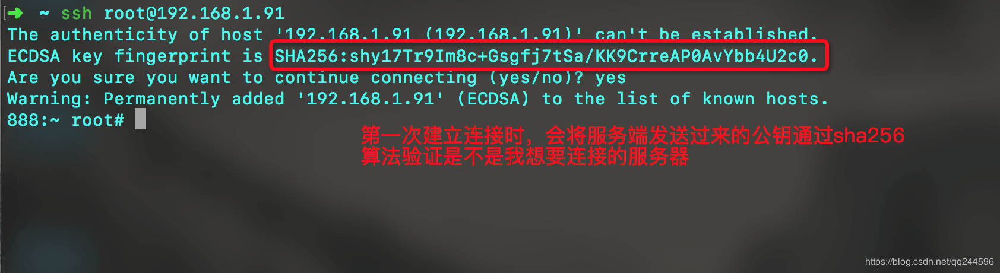

# OpenSSH

本文运行环境：iPhone6、10.2、yalu102越狱

## 一、简介
### 0x01 ssh

+ `Secure Shell`的缩写，意为“安全外壳协议”，是一种可以为远程登录提供安全保障的协议 ；
	
+ 使用SSH，可以把所有传输的数据进行加密，“中间人”攻击方式就不可能实现，能防止DNS欺骗和IP欺骗。

### 0x02 OpenSSH

- 是SSH协议的免费开源实现
	
- 可以通过`OpenSSH`的方式让Mac远程登录到 iPhone

这里有个很重要的概念：通过`OpenSSH`的方式让 Mac 远程登录到 iPhone 时，**Mac是客户端，iPhone是服务端**。

## 二、安装 OpenSSH

对于iOS8和iOS9的设备需要在`Cydia`中添加软件源`http://apt.saurik.com`，然后搜索并安装`OpenSSH`。


对于 iOS10.0 ~ iOS10.2 的设备，则不用手动安装`OpenSSH`。因为`yalu`内置了一个轻量级的`OpenSSH`服务`dropbear`。在Cydia中添加软件源`http://cydia.ichitaso.com/test`，然后搜索并安装`dropbear`。


## 三、通过Wifi登录到iPhone

SSH 是通过 TCP 协议通信，所以必须要保证 mac 和 iPhone 在同一局域网下，如连接到同一个 wifi 下。默认密码`alpine`

```
// 登录	
$ ssh root@iPhone ip(服务端主机地址)
 
// 退出
$ exit (或快捷键command + d)
 
// 修改密码
$ passwd
```
		 


要想使用`OpenSSH`通信必须保证客户端和服务端的`SSH`的版本一致。 查看`SSH`版本也就是查看配置文件的Protocol字段值。

- 客户端：`/etc/ssh/ssh_config`
	
- 服务端：`/etc/ssh/sshd_config`	

### 0x01 SSH 通信过程 

- 建立安全连接
	 
当客户端向服务端发送连接请求时，服务端会将自己的公钥等信息发送给客户端，来确保所连接的服务端是没被更改过的。客服端在`~/.ssh/known_hosts`中保存服务端的公钥信息。


如果客户端并无服务器端的公钥信息，就会询问是否连接此服务器(如下图)。如果客户端已保存服务端的公钥信息并和发送过来的公钥信息一致，则直接连接。
	


- 验证服务端是否将公钥发送给客户端，且客户端保存在`~/.ssh/known_hosts`。
	


**注意：** iOS9设备的服务端公钥路径在`/etc/.ssh/ssh_host_key.pub`

- 当出现如下错误时，提醒你服务端的身份信息发生改变(同一个ip但公钥信息不一样)，可能会被中间人攻击。


这时可以判断指纹信息是否是你想要链接的服务器，如果是且想要继续登录到iPhone 则有以下办法

+ 用`vim ~/.ssh/known_hosts` 删除对应ip的公钥信息

+ 使用命令`ssh-keygen -R 服务器ip` 直接删除对应的公钥信息

### 0x02 客户端认证  
	 
SSH-2提供了基于密码的客户端验证(账号密码登录)和基于秘钥的客户端验证(免密码登录)。SSH-2优先尝试"秘钥认证"，若秘钥认证失败，才会尝试"密码认证"。

- 流程
	


首先客户端会生成一对公钥和私钥，然后将公钥信息拷贝到授权文件尾部。最后用私钥进行登录认证

- 具体实现
	


- 验证是否追加到尾部
	


## 四、通过USB登录到iPhone

默认情况下，由于`SSH`走的是 TCP 协议，Mac是通过网络连接的方式`SSH`登录到 iPhone，要求 iPhone 连接 WiFi。这时数据传输受 wifi 网速限制，有时输入命令卡半天都出不来。为了加快传输速度，也可以通过 USB 连接的方式进行 SSH 登录。 

Mac上有个服务程序`usbmuxd`（它会开机自动启动），可以将 Mac 的数据通过 USB 传输到iPhone,路径在`/System/Library/PrivateFrameworks/MobileDevice.framework/Resources/usbmuxd`下。 

客户端先登录到10010端口，这样客户端每次先往10010端口写数据，然后`usbmuxd`会将10010端口的数据通过USB转到22端口。


### 0x01 `usbmuxd`使用

+ 下载usbmuxd工具`https://cgit.sukimashita.com/usbmuxd.git/snapshot/usbmuxd-1.0.8.tar.gz`

+ 将 iPhone 的22端口（SSH端口）映射到 Mac 本地的2222端口
	
```
$ cd ~/您保存usbmuxd路径/usbmuxd-1.0.8/python-client
	
// -t参数是为了能够同时支持多个SSH连接
$ python tcprelay.py -t 22:2222
```		
		


**注意：** 要想保持端口映射状态，不能终止此命令行（如果要执行其他终端命令行，请新开一个终端界面）

- 新开一个终端界面，SSH登录到Mac本地的2222端口

```
$ ssh root@localhost -p 2222
```


## 五、通过iproxy登录到iPhone
`usbmuxd`附带了一个小工具`iproxy`,通过它可以更方便映射端口，连接到`iPhone`。

```		
$ iproxy 2222 22
```


## 六、坑

- 文件权限 

如果配置了免密码登录后，还是需要输入密码，需要在服务器端设置文件权限

```
$ chmod 755 ~
$ chmod 755 ~/.ssh
$ chmod 644 ~/.ssh/authorized_keys
```
	

写于2018-12-15