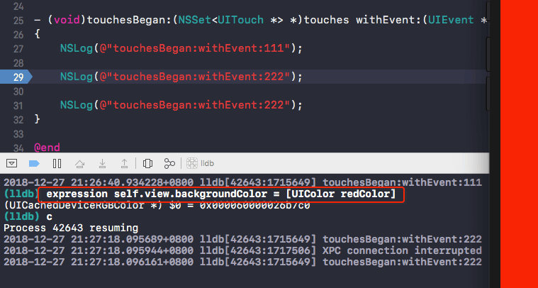

# lldb命令

1.使程序断开 准备lldb链接

	$ debugserver *:1234 -a "processName or pid"
	
2.电脑链接到手机进程

	$ process connect connect://localhost:1234

3.加载模块基地址

	$ image list -o -f

4.地址断点

	$ br s -a '基地址+偏移地址'

5.打印调用信息

	$ po $r0  :调用者（类）
	$ x/s $r1 :调用方法 SEL
	$ po $r2  :第一个参数
	$ po $r3  :第二个参数
	
6.打印所有寄存器

	$ register read
	
7.修改寄存器的值

	$register write 所要修改的寄存器 值
	
 8.读取地址上的内存
 
 	$ memory read 地址
 	
 9.修改地址上的内存
 
 	$ memory write 地址 值
 	
 10.查看断点
 
 	$ br list
 	
 11.添加命令，在断点断下来的时候，自动执行
 
 	$ br com add 断点标号(br list获得)
 	
 	命令输入完时，输入DONE+回车 退出
 	
 <font color=red>12.打印当前断点处的调用堆栈信息</font>
 
 	$ bt //获取的是内存中的虚拟地址
 	
 	用p/x 虚拟地址 - 基地址 命令获取方法的偏移地址
 	
 
写于2018-07-14

<br><br>

- help 查看指令的用法(类似`--help`)


	```
	(lldb) help breakpoint

	...
	disable -- Disable the specified breakpoint(s) without deleting them.  If none are specified, disable all breakpoints.
	list -- List some or all breakpoints at configurable levels of detail.
	set -- Sets a breakpoint or set of breakpoints in the executable.
	...
	```

### expression

- expression：执行一个表达式

    - 常用于调试时不用重新运行程序，动态添加代码

    - 命令选项结束符`--`，表示所有命令选择均设置完成，若没有命令选项`--`可以省略

    - `expression`和指令`print`、`p`、`call`的效果一样

    - `expression -O --`和指令`po`的效果一样

	```
	(lldb) expression self.view.backgroundColor = [UIColor redColor]
	``` 

	


### thread

- 打印当前调用堆栈信息,类似于`bt`

```
(lldb) thread backtrace
``` 

- 让函数直接执行某个值，不会执行断点后面的代码

```
(lldb) thread return
```

- 打印当前栈帧的变量

```
(lldb) frame variable
```

- 程序继续运行

```
(lldb) thread continue 或 continue􏰁 或 c
```

- 单步运行一句代码，遇到函数不进入

```
(lldb) thread step-over 或 􏰁next 或 􏰁n
```

- 单步运行一句代码，遇到函数进入

```
(lldb) thread step-in 或 􏰁step 或 􏰁s
```

- 􏱃􏱄􏰞􏰟􏰭􏱏􏱐􏰖􏰒􏰆􏰩􏰪􏱍􏱎􏰧􏱅􏱆􏱟􏱢􏰠􏰡􏰖􏰒􏱃􏱄􏰞􏰟􏰭􏱏􏱐􏰖􏰒􏰆􏰩􏰪􏱍􏱎􏰧􏱅􏱆􏱟􏱢􏰠􏰡􏰖􏰒直接执行完当前函数的所有代码，返回到上一个函数

```
(lldb) thread step-out 或 􏰁finish
```

- 单步运行一条汇编指令，遇到函数不进入

```
(lldb) thread step-over-inst-over 或 􏰁nexti 或 􏰁ni
```

- 单步运行一条汇编指令，遇到函数进入

```
(lldb) thread step-inst 或 􏰁stepi 或 􏰁si
```

### breakpoint

- 给C函数设置断点

```
(lldb) breakpoint set -n 函数名
```

- 给OC方法设置断点

```
(lldb) breakpoint set -n "-[类名 方法名]"

# 例
(lldb) breakpoint set -n "-[ViewController touchesBegan:withEvent:]"
```

- 模糊查询方法

```
# -r表示正则匹配
(lldb) breakpoint set -r touchesBegan:withEvent:
```

- 给某个动态库的某个函数打断点

```
(lldb) breakpoint set -s 动态库名 -n 方法名
```

- 禁用断点

```
(lldb) breakpoint disable 断点编号
```

- 启用断点

```
(lldb) breakpoint enable 断点编号
```

- 删除断点

```
(lldb) breakpoint delete 断点编号
```

- 给断点预先设置要执行的指令，等断点出发时，就会顺序执行

```
(lldb) breakpoint set -n "-[ViewController click]"
Breakpoint 2: where = lldb`-[ViewController click] + 23 at ViewController.m:44, address = 0x000000010603e6d7

(lldb) breakpoint command add 2
Enter your debugger command(s).  Type 'DONE' to end.
> po self
> expression -O -- self.view
> DONE
(lldb) c
Process 43642 resuming

 po self
<ViewController: 0x7fbf3b50bc90>

 expression -O -- self.view
<UIView: 0x7fbf3b40a030; frame = (0 0; 375 812); autoresize = W+H; layer = <CALayer: 0x60000042cce0>>
```

- 查看某个断点设置的命令

```
(lldb) breakpoint command list 断点编号

Breakpoint 2:
    Breakpoint commands:
      po self
      expression -O -- self.view
```

- 删除某个断点设置的指令

```
(lldb) breakpoint command delete 断点编号
```

### watchpoint

- 在内存数据发生改变时触发（也称内存断点）

```
(lldb) watchpoint set variable 变量或地址

# 示例
(lldb) watchpoint set variable self->_age
Watchpoint created: Watchpoint 1: addr = 0x7fa003e10fb0 size = 4 state = enabled type = w
    watchpoint spec = 'self->_age'
    new value: 0
(lldb) c
Process 44580 resuming

Watchpoint 1 hit:
old value: 0
new value: 20
```

- 内存断点有类似`breakpoint`的指令

```
# 列出设置的内存断点
(lldb) watchpoint list 

# 禁用内存断点
(lldb) watchpoint disable 断点标号

# 启用内存断点
(lldb) watchpoint enable 断点编号

# 删除内存断点
(lldb) watchpoint delete 断点编号

# 给内存断点添加要执行的指令
(lldb) watchpoint command add 断点编号

# 列出某个内存断点要执行的指令
(lldb) watchpoint command list 断点编号

# 删除某个内存断点要执行的指令
(lldb) watchpoint command delete 断点编号
```

### image lookup

- 查找某个符号或函数实现的位置

```
(lldb) image lookup -n click

...
Address: lldb[0x0000000100001560] (lldb.__TEXT.__text + 336)
Summary: lldb`-[ViewController click] at ViewController.m:45
...
```

- 查找某个类型的信息

```
(lldb) image lookup -t Person

1 match found in ~/Library/Developer/Xcode/DerivedData/lldb-gtyjypcpzfehgihfxlpnicmgpvcz/Build/Products/Debug-iphonesimulator/lldb.app/lldb:
id = {0x30000002b}, name = "Person", byte-size = 8, decl = Person.h:11, compiler_type = "@interface Person : NSObject
@end"
```

- 根据内存地址查找在模块中的位置，常用于确定崩溃信息位置

```
(lldb) image lookup -a 内存地址
```

<br>

 **更新于2018-12-27** 
 
<br>