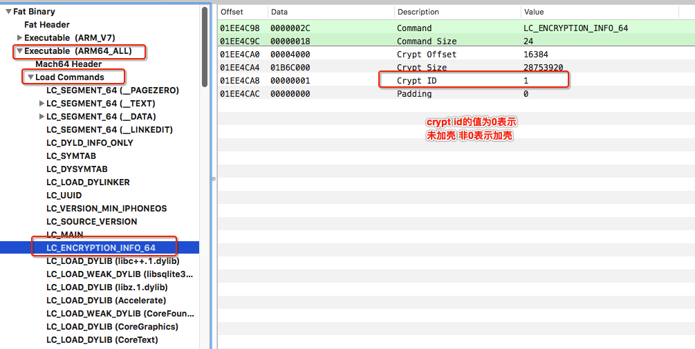
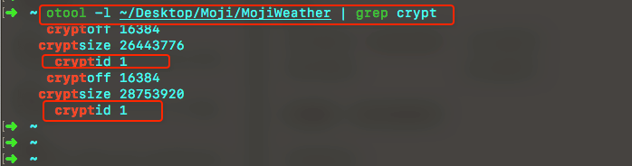
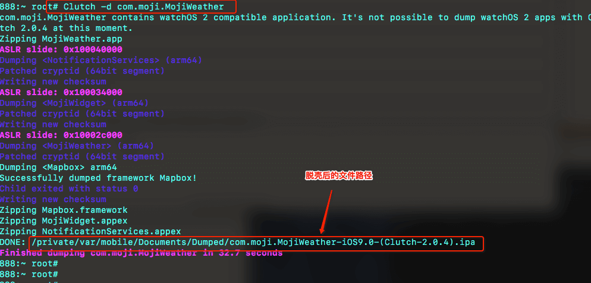
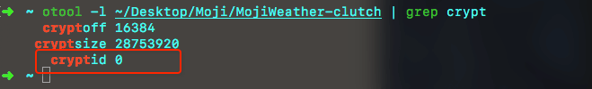
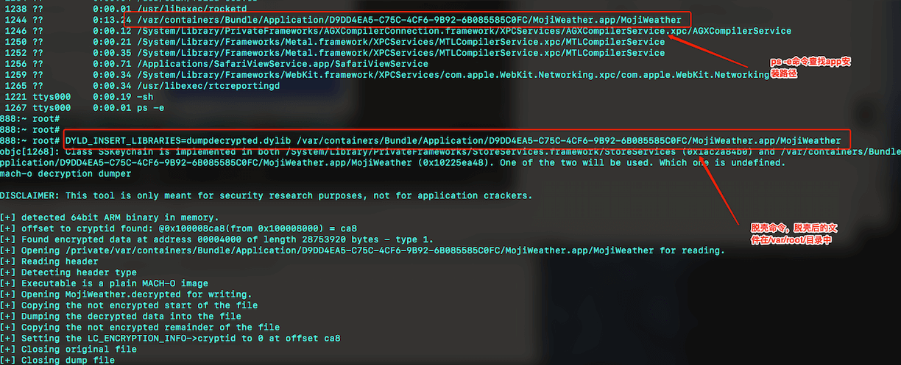
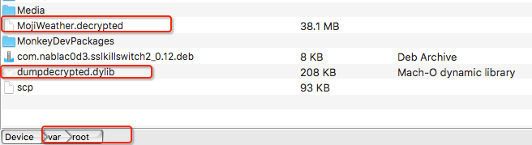

我们从App Store下载的应用都是利用特殊的算法，对可执行文件的编码进行改变（比如压缩、加密），以达到保护程序代码的目的 -- 加壳。

若我们想逆向某个应用，加壳的ipa文件无论是class-dump，还是拖到ida64中静态分析都是不行的。这时就需要我们进行砸壳操作。

###  0x01 判断是否加壳

- MachOView

找到可执行文件直接用`MachOView`打开，找到`Exexutable` -> `Load Commands` -> `LC_ENCRYPTION_INFO_64(或LC_ENCRYPTION_INFO)` -> `Crypt ID`的值。 
	


- 命令行查看

```
$ otool -l 可执行文件路径 | grep crypt
```


**crypt 的值为0表示未加密、非0表示加密。**


### 0x02 Clutch脱壳

- 到`https://github.com/KJCracks/Clutch/releases`下载最新版的`Clutch`

- 将`Clutch`放到手机`/usr/bin/`目录下
- `ssh`登录到手机 执行命令`Clutch -d bundleId`进行脱壳　



- 找到脱壳后的可执行文件，验证其是否加壳　



### 0x03 dumpdecrypted脱壳

- 下载源代码`https://github.com/stefanesser/dumpdecrypted/`

- 在源代码目录执行make指令进行编译，获得`dumpdecrypted.dylib`动态库文件
- 将`dumpdecrypted.dylib`文件拷贝到手机上（如果是root用户，建议放`/var/root/`目录）
- `ssh`登录到手机，`cd`到`dumpdecrypted.dylib`所在目录
- 使用环境变量`DYLD_INSERT_LIBRARIES`将`dumpdecrypted.dylib`注入到需要脱壳的可执行文件

```
$ DYLD_INSERT_LIBRARIES=dumpdecrypted.dylib 可执行文件路径(ps -e 查看)
```

　



- 验证其是否脱壳

```
~ otool -l ~/Desktop/Moji/MojiWeather.decrypted | grep crypt

~/Desktop/Moji/MojiWeather.decrypted:
 cryptoff 16384
cryptsize 28753920
  cryptid 0
```

### 0x04 坑

#### 直接将`Clutch`拖到手机执行可能会出现无权限的错误

```
~ root# Clutch
sh: /usr/bin/Clutch: Permission denied
```

赋予其权限

```
$ chmod +x Clutch
```

#### `dumpdecrypted.dylib`所在的文件夹权限不够

**解决方案：**将`dumpdecrypted.dylib`放在用户所在文件夹，如若是root用户，请将dylib放在`/var/root`目录下。
	
- `dumpdecrypted.dylib`签名错误 

报错信息
> dyld: could not load inserted library ‘dumpdecrypted.dylib’ because no suitable image found.
	
>  Did find: dumpdecrypted.dylib: required code signature missing for ‘dumpdecrypted.dylib

解决办法

```
//列出可签名证书
$ security find-identity -v -p codesigning

//为dumpecrypted.dylib签名
$ codesign --force --verify --verbose --sign "iPhone Developer: xxx xxxx (xxxxxxxxxx)" dumpdecrypted.dylib
```

**写于2018-12-17**